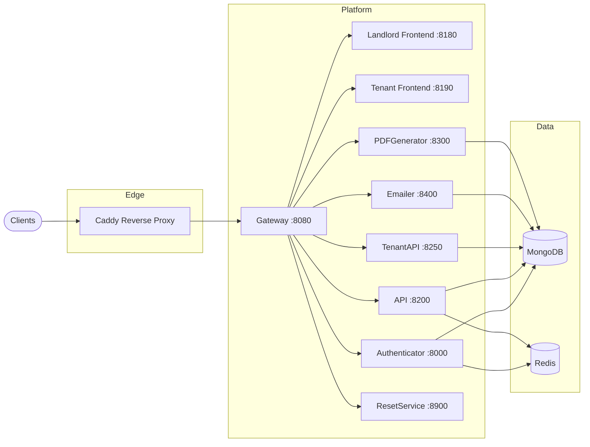
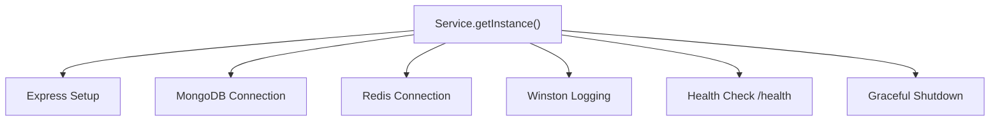
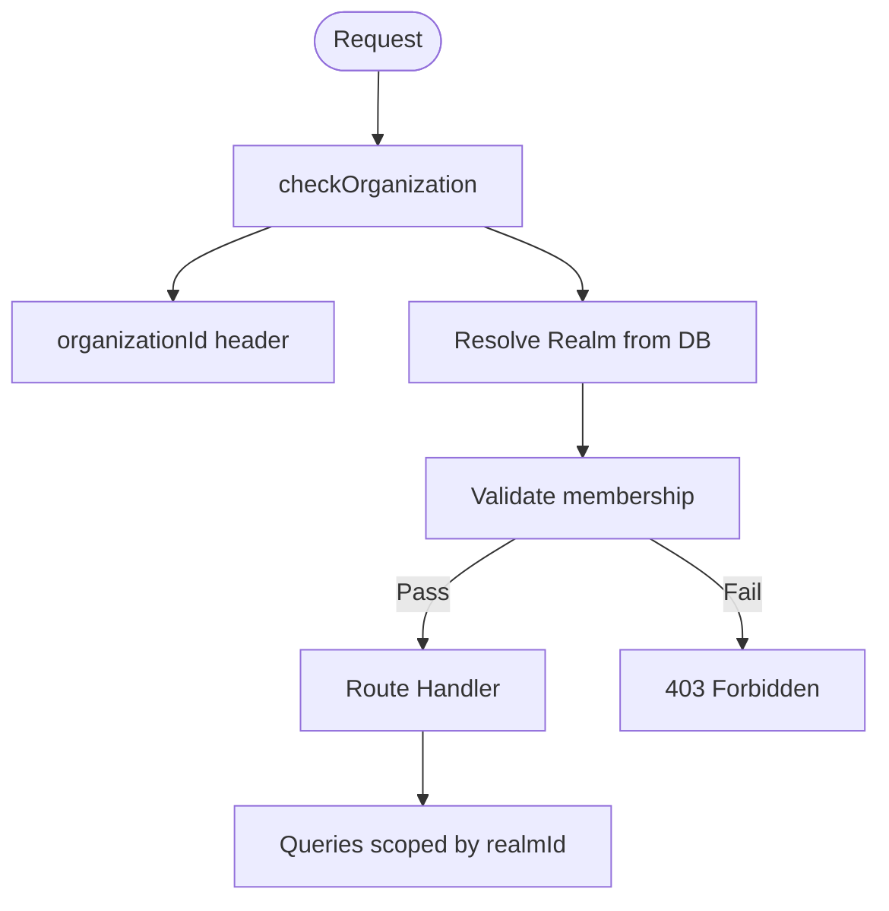
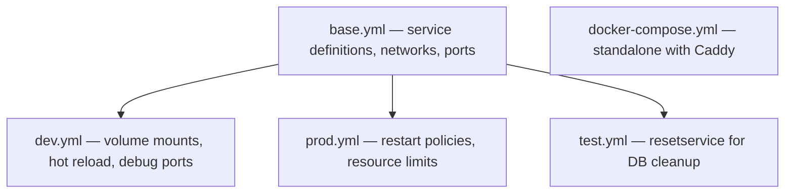
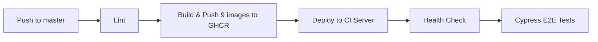

# MicroRealEstate Architecture

## System Architecture

MicroRealEstate follows a microservices pattern with all services running as Docker containers on a shared bridge network. A single **Gateway** (`:8080`) acts as the entry point, reverse-proxying requests to the appropriate backend service. In standalone deployment, **Caddy** sits in front for automatic HTTPS.

### Gateway Routing

| Route Pattern | Target Service | Notes |
|---|---|---|
| `/api/v2/authenticator/*` | Authenticator | Auth endpoints |
| `/api/v2/documents/*`, `/api/v2/templates/*` | PDFGenerator | Document generation |
| `/api/v2/*` | API | Landlord API (catch-all) |
| `/tenantapi/*` | TenantAPI | Tenant-facing API |
| `/api/reset/*` | ResetService | Non-production only |
| `/landlord/*` | Landlord Frontend | Landlord SPA |
| `/tenant/*` | Tenant Frontend | Tenant SPA |

Routes are evaluated in order; more specific patterns match before the `/api/v2/*` catch-all.

## Service Bootstrap Pattern

All backend services share a `Service` class from `@microrealestate/common` (singleton). It standardizes startup, connections, and shutdown.

Each service calls `Service.getInstance()`, configures options (`useMongo`, `useRedis`, `useAxios`), registers routes via `onStartUp`, and starts.

## Authentication Architecture

JWT-based with access + refresh token pair.

| Token | Lifetime | Storage |
|---|---|---|
| Access token | ~5 minutes | Client memory / Authorization header |
| Refresh token | 10min prod / 12h dev | Redis (server-side) |

- **Landlord API** — `Authorization: Bearer <accessToken>` header
- **Tenant API** — `sessionToken` cookie

### Middleware Chain

1. **`needAccessToken`** — validates and decodes the JWT
2. **`checkOrganization`** — resolves Realm from `organizationId` header, validates membership
3. **Role checks** — verifies required role (`administrator`, `renter`, `tenant`)

### Principal Types

| Type | Description |
|---|---|
| `user` | Human user (landlord or tenant) |
| `application` | External API client |
| `service` | Internal service-to-service |

## Multi-tenancy (Organizations / Realms)

Each landlord can belong to multiple organizations (stored as **Realm** documents). All data queries are scoped by `realmId`.

## Docker Compose Overlay Strategy

Usage: `docker compose -f base.yml -f dev.yml up`

## CI/CD Pipeline

GitHub Actions on push to `master`:

Images: gateway, api, tenantapi, authenticator, pdfgenerator, emailer, resetservice, landlord-frontend, tenant-frontend.
