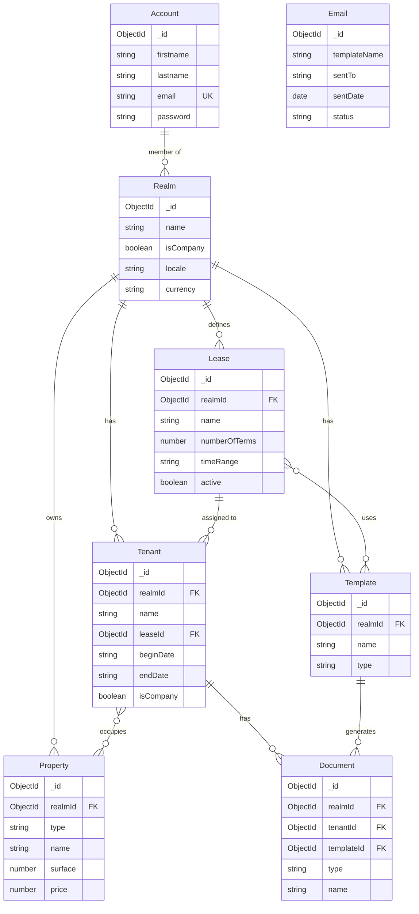

# MicroRealEstate Data Models

## Entity Relationship Diagram

## Collections

Defined in `services/common/src/collections/`. TypeScript types in `CollectionTypes` namespace at `types/src/common/collections.ts`.

### Account

User accounts for authentication. Fields: `_id`, `firstname`, `lastname`, `email` (unique), `password` (bcrypt hash).

### Realm (Organization)

Organizations that group all resources. Fields: `_id`, `name`, `isCompany`, `locale`, `currency`, `members[]` (name, email, role, registered), `addresses`, `bankInfo`, `thirdParties`.

### Tenant (Mongoose model: `Occupant`)

> **Important:** The Mongoose model is registered as `'Occupant'` but TypeScript types and API routes use `Tenant`.

Fields: `_id`, `realmId`, `name`, `leaseId`, `beginDate`, `endDate`, `isCompany`, `contacts[]`, `properties[]` (propertyId), `rents[]`.

#### Rent entry structure

Each element in `rents[]`: `term` (YYYYMMDDHH format), `grandTotal`, `payment`, `balance`, `description`, `preTaxAmounts`, `charges`, `vats`, `discounts`, `debts`, `settlements`.

### Property

Rental properties. Fields: `_id`, `realmId`, `type`, `name`, `description`, `surface`, `phone`, `building`, `level`, `location` (lat/lng), `price`, `expense` (title, amount), `tax`.

### Lease

Lease templates. Fields: `_id`, `realmId`, `name`, `numberOfTerms`, `timeRange` (months/weeks/days/years), `active`, `system`, `templateIds[]`, `expenses[]`.

### Template

Document templates. Fields: `_id`, `realmId`, `name`, `type` (text/fileDescriptor), `description`, `hasExpiryDate`, `required`, `contents` (html/css), `linkedResourceIds[]`.

### Document

Generated documents. Fields: `_id`, `realmId`, `tenantId`, `templateId`, `type`, `name`, `description`, `mimeType`, `expiryDate`, `url`, `versionId`.

### Email

Email sending records. Fields: `_id`, `templateName`, `sentTo`, `sentDate`, `status`, `params`.

## Rent Computation Pipeline

Rent is computed through a 7-step pipeline in `services/api/src/businesslogic/`:

1. **Base rent** — from `Property.price`
2. **Debts** — unpaid balances carried from previous terms
3. **Expenses/charges** — from `Lease.expenses` and `Property.expense`
4. **Discounts** — applied reductions
5. **VAT** — tax computation
6. **Settlements** — payments recorded against the term
7. **Grand total** — final amount due

Rent terms use `YYYYMMDDHH` format (e.g., `2026040100` for April 2026).
