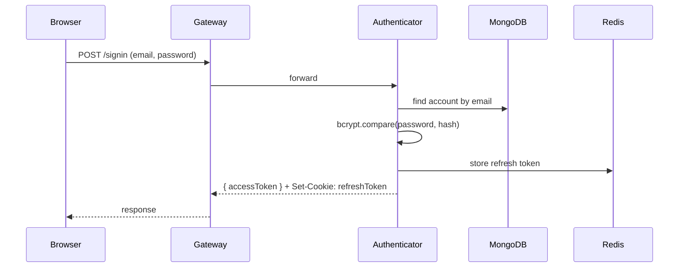
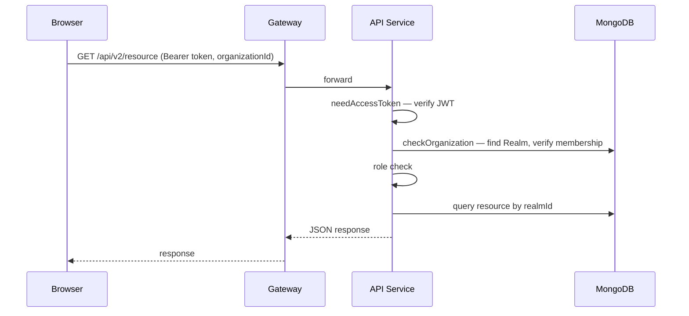
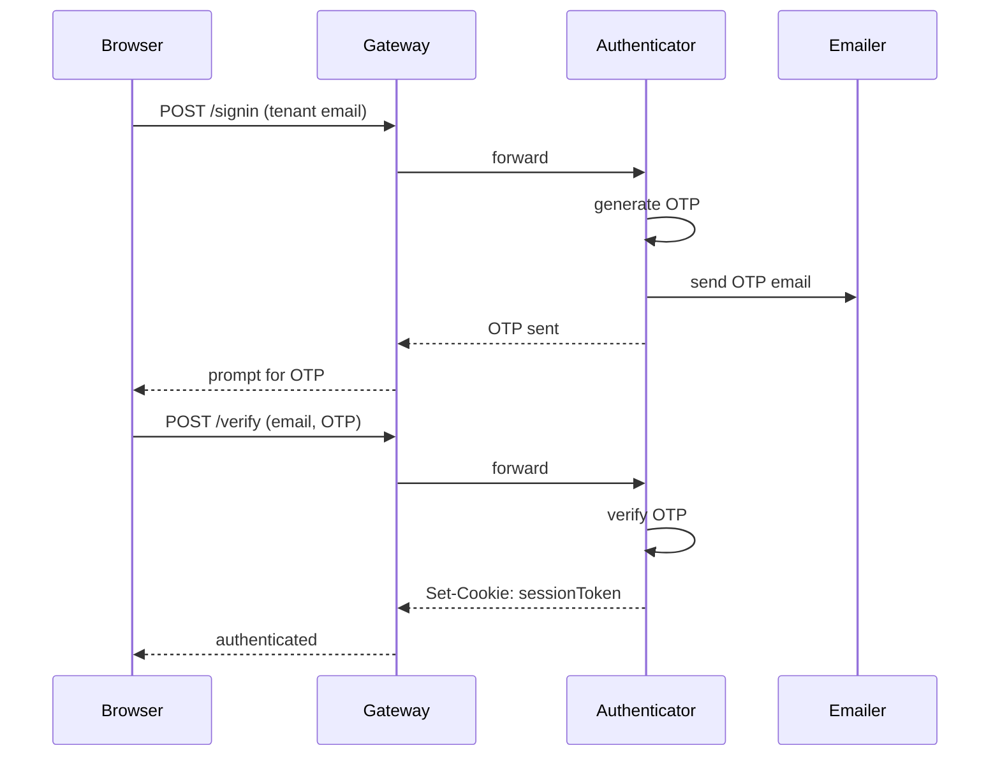
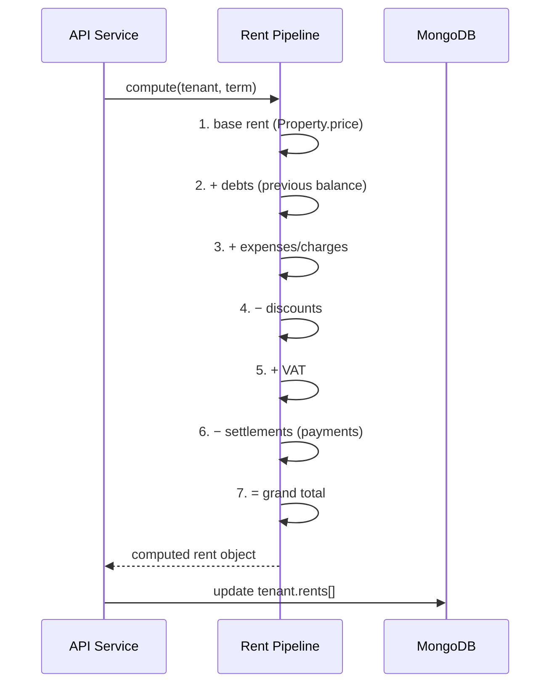
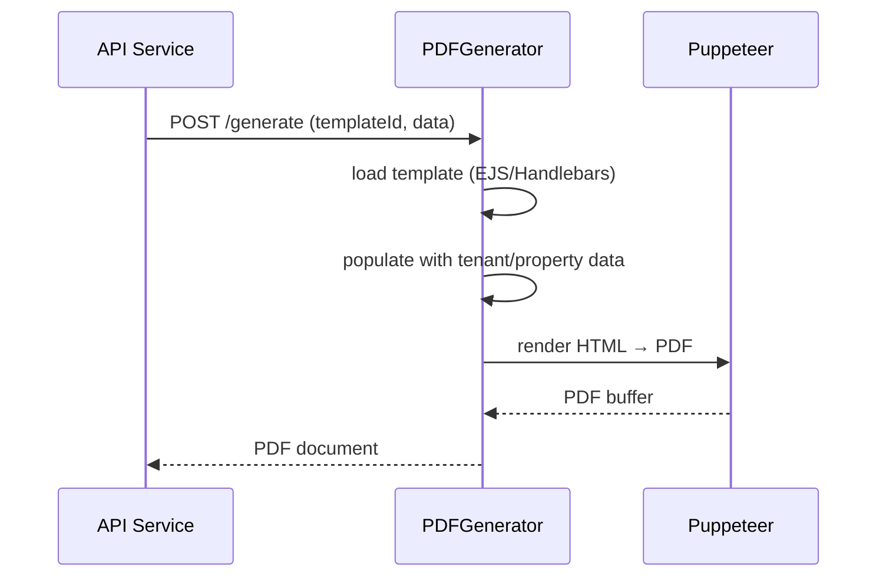
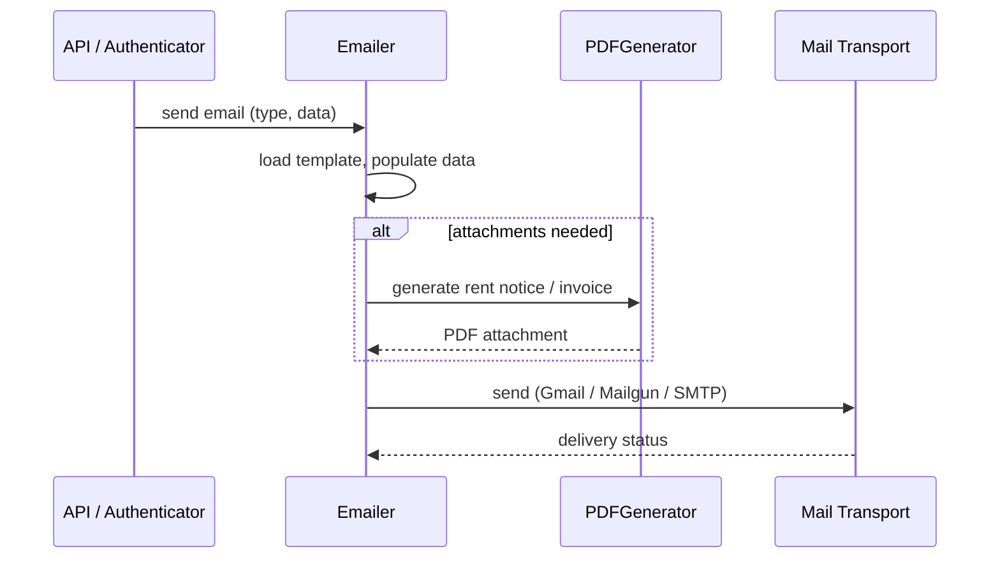

# MicroRealEstate — Key Workflows

## Authentication Flow (Landlord)

## Authenticated API Request

## Tenant Sign-In Flow

## Rent Computation

Triggered when a tenant is created or updated (PATCH). Pipeline computes the final amount for each rent period.

## Document Generation

## Email Sending

## Tenant Lifecycle

1. Create tenant with lease, property, expenses → rent computation triggered
2. Monthly: view rents, record payments → settlements applied, balance updated
3. Generate/send notices and receipts via emailer + pdfgenerator
4. Terminate lease (set termination date) → tenant marked terminated, property vacant

## First Access / Onboarding

1. User signs up → account created
2. First login → redirected to `/firstaccess`
3. Fill landlord info (name, company details) → Organization (Realm) created
4. Dashboard shows first-connection wizard: create lease → add property → add tenant

## Token Refresh

Access tokens expire after ~5 minutes. The frontend interceptor (`fetch.js`) automatically calls `/refreshtoken` with the refresh token cookie. New access token returned. If refresh token expired, user redirected to `/signin`.
