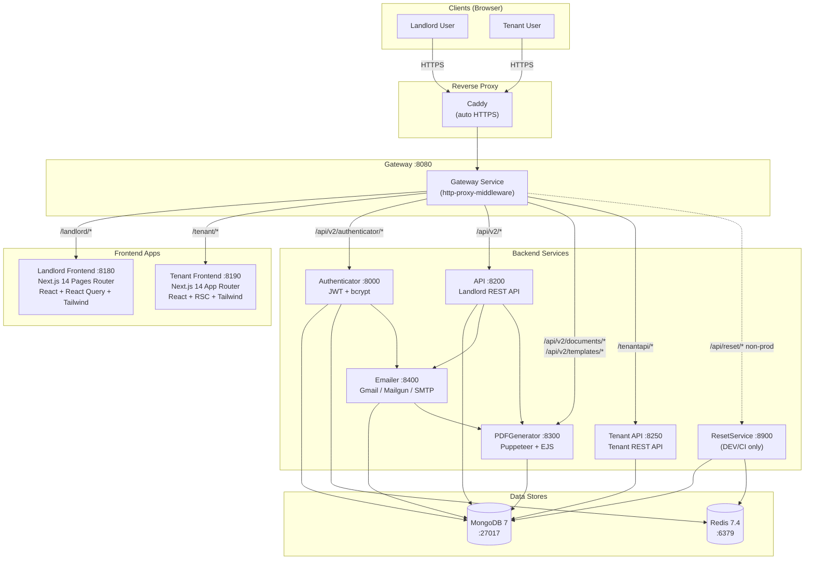
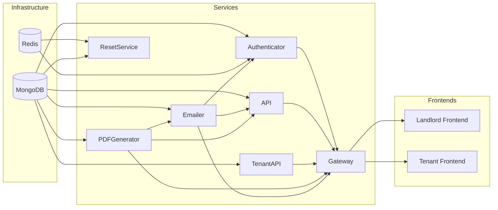
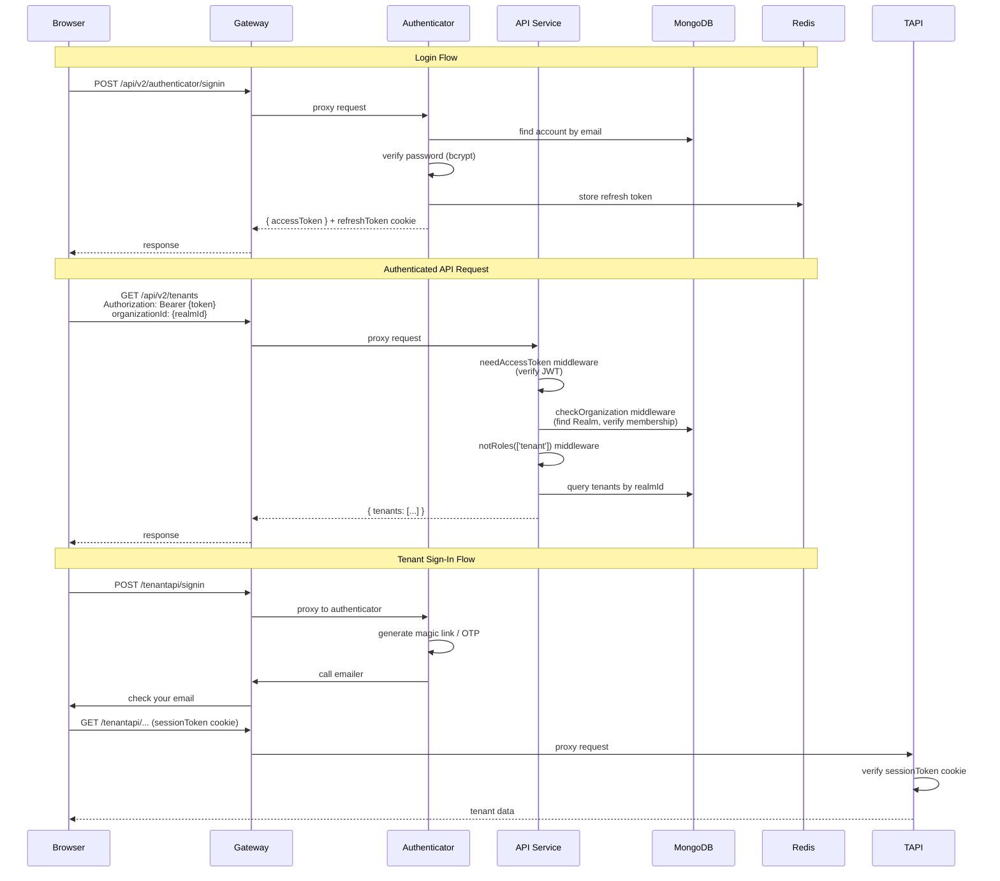
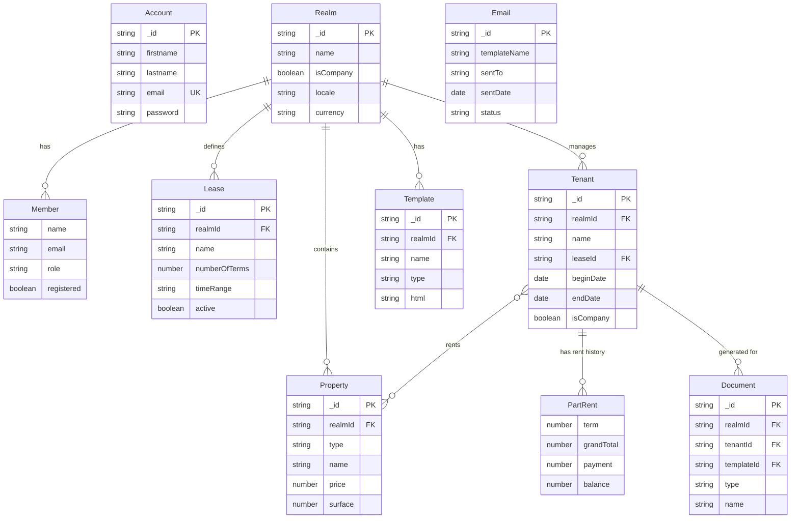
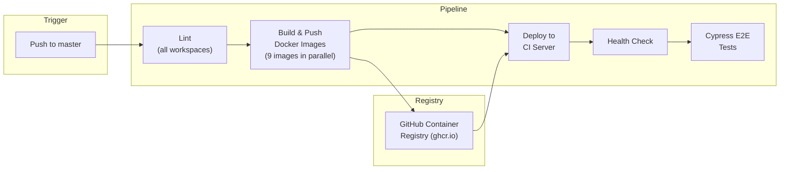
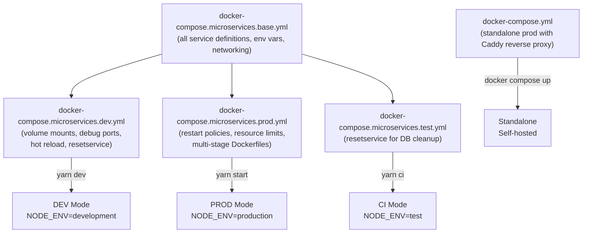

# MRE — Architecture Diagrams

## 1. High-Level System Architecture

## 2. Service Dependency Graph

Note: arrows point from dependency to dependent (X → Y means Y depends on X).

## 3. Authentication & Request Flow

## 4. Data Model (Entity Relationships)

## 5. CI/CD Pipeline

Images built: gateway, api, tenantapi, authenticator, pdfgenerator, emailer, resetservice, landlord-frontend, tenant-frontend.

## 6. Docker Compose Overlay Strategy

