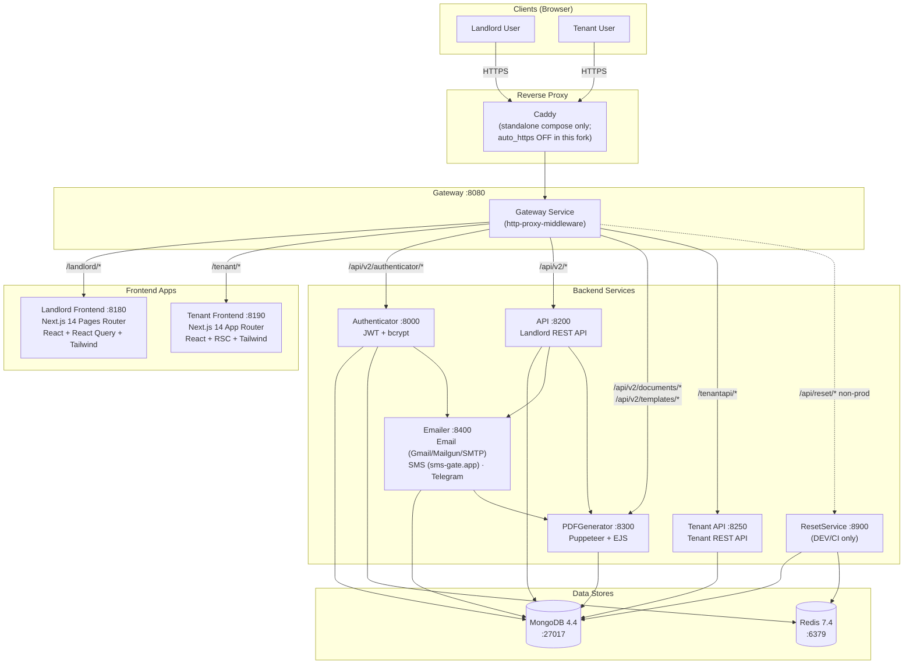
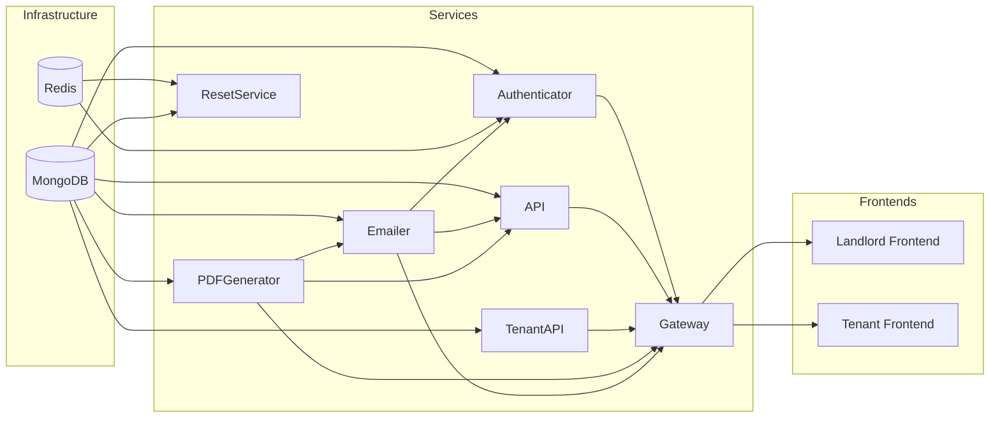
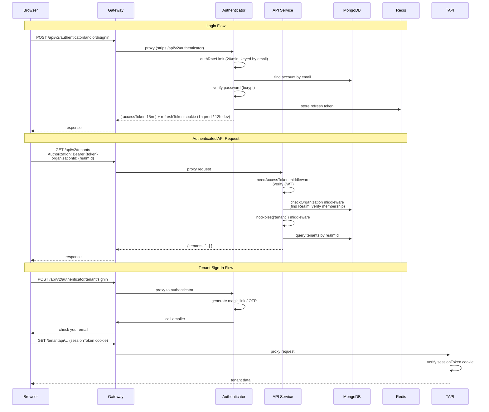
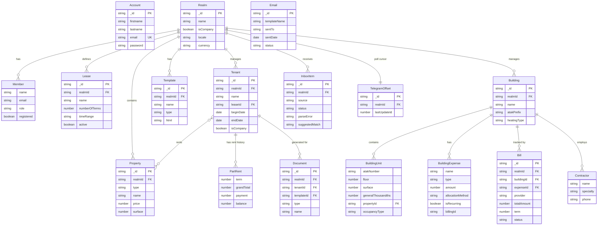
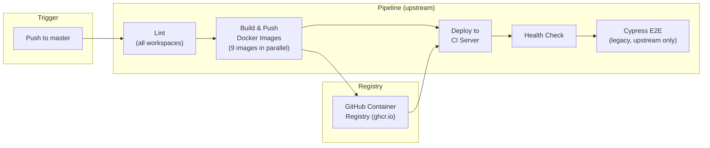
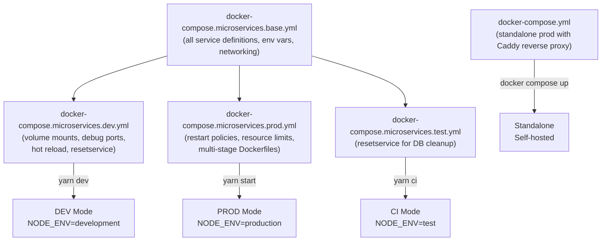

# MRE — Architecture Diagrams

## 1. High-Level System Architecture

```mermaid
graph TB
    subgraph Clients["Clients (Browser)"]
        Landlord["Landlord User"]
        TenantUser["Tenant User"]
    end

    subgraph ReverseProxy["Reverse Proxy"]
        Caddy["Caddy<br/>(standalone compose only;<br/>auto_https OFF in this fork)"]
    end

    subgraph Gateway["Gateway :8080"]
        GW["Gateway Service<br/>(http-proxy-middleware)"]
    end

    subgraph Frontends["Frontend Apps"]
        LF["Landlord Frontend :8180<br/>Next.js 14 Pages Router<br/>React + React Query + Tailwind"]
        TF["Tenant Frontend :8190<br/>Next.js 14 App Router<br/>React + RSC + Tailwind"]
    end

    subgraph BackendServices["Backend Services"]
        AUTH["Authenticator :8000<br/>JWT + bcrypt"]
        API["API :8200<br/>Landlord REST API"]
        TAPI["Tenant API :8250<br/>Tenant REST API"]
        EMAIL["Emailer :8400<br/>Email (Gmail/Mailgun/SMTP)<br/>SMS (sms-gate.app) · Telegram"]
        PDF["PDFGenerator :8300<br/>Puppeteer + EJS"]
        RESET["ResetService :8900<br/>(DEV/CI only)"]
    end

    subgraph DataStores["Data Stores"]
        MONGO[("MongoDB 4.4<br/>:27017")]
        REDIS[("Redis 7.4<br/>:6379")]
    end

    Landlord -->|HTTPS| Caddy
    TenantUser -->|HTTPS| Caddy
    Caddy --> GW

    GW -->|/landlord/*| LF
    GW -->|/tenant/*| TF
    GW -->|/api/v2/authenticator/*| AUTH
    GW -->|/api/v2/*| API
    GW -->|/api/v2/documents/*<br/>/api/v2/templates/*| PDF
    GW -->|/tenantapi/*| TAPI
    GW -.->|/api/reset/* non-prod| RESET

    AUTH --> MONGO
    AUTH --> REDIS
    AUTH --> EMAIL
    API --> MONGO
    API --> EMAIL
    API --> PDF
    TAPI --> MONGO
    EMAIL --> MONGO
    EMAIL --> PDF
    PDF --> MONGO
    RESET --> MONGO
    RESET --> REDIS
```

## 2. Service Dependency Graph

```mermaid
graph LR
    subgraph Infrastructure
        MONGO[("MongoDB")]
        REDIS[("Redis")]
    end

    subgraph Services
        GW[Gateway]
        AUTH[Authenticator]
        API[API]
        TAPI[TenantAPI]
        EMAIL[Emailer]
        PDF[PDFGenerator]
        RESET[ResetService]
    end

    subgraph Frontends
        LF[Landlord Frontend]
        TF[Tenant Frontend]
    end

    MONGO --> PDF
    MONGO --> EMAIL
    PDF --> EMAIL
    MONGO --> AUTH
    REDIS --> AUTH
    EMAIL --> AUTH
    MONGO --> API
    EMAIL --> API
    PDF --> API
    MONGO --> TAPI
    REDIS --> RESET
    MONGO --> RESET
    AUTH --> GW
    API --> GW
    TAPI --> GW
    PDF --> GW
    EMAIL --> GW
    GW --> LF
    GW --> TF
```

Note: arrows point from dependency to dependent (X → Y means Y depends on X).

## 3. Authentication & Request Flow

```mermaid
sequenceDiagram
    participant B as Browser
    participant GW as Gateway
    participant AUTH as Authenticator
    participant API as API Service
    participant DB as MongoDB
    participant R as Redis

    Note over B,R: Login Flow
    B->>GW: POST /api/v2/authenticator/landlord/signin
    GW->>AUTH: proxy (strips /api/v2/authenticator)
    AUTH->>AUTH: authRateLimit (20/min, keyed by email)
    AUTH->>DB: find account by email
    AUTH->>AUTH: verify password (bcrypt)
    AUTH->>R: store refresh token
    AUTH-->>GW: { accessToken 15m } + refreshToken cookie (1h prod / 12h dev)
    GW-->>B: response

    Note over B,R: Authenticated API Request
    B->>GW: GET /api/v2/tenants<br/>Authorization: Bearer {token}<br/>organizationId: {realmId}
    GW->>API: proxy request
    API->>API: needAccessToken middleware<br/>(verify JWT)
    API->>DB: checkOrganization middleware<br/>(find Realm, verify membership)
    API->>API: notRoles(['tenant']) middleware
    API->>DB: query tenants by realmId
    API-->>GW: { tenants: [...] }
    GW-->>B: response

    Note over B,R: Tenant Sign-In Flow
    B->>GW: POST /api/v2/authenticator/tenant/signin
    GW->>AUTH: proxy to authenticator
    AUTH->>AUTH: generate magic link / OTP
    AUTH->>GW: call emailer
    GW->>B: check your email
    B->>GW: GET /tenantapi/... (sessionToken cookie)
    GW->>TAPI: proxy request
    TAPI->>TAPI: verify sessionToken cookie
    TAPI-->>B: tenant data
```

## 4. Data Model (Entity Relationships)

```mermaid
erDiagram
    Account {
        string _id PK
        string firstname
        string lastname
        string email UK
        string password
    }

    Realm {
        string _id PK
        string name
        boolean isCompany
        string locale
        string currency
    }

    Realm ||--o{ Member : has
    Member {
        string name
        string email
        string role
        boolean registered
    }

    Realm ||--o{ Property : contains
    Property {
        string _id PK
        string realmId FK
        string type
        string name
        number price
        number surface
    }

    Realm ||--o{ Lease : defines
    Lease {
        string _id PK
        string realmId FK
        string name
        number numberOfTerms
        string timeRange
        boolean active
    }

    Realm ||--o{ Tenant : manages
    Tenant {
        string _id PK
        string realmId FK
        string name
        string leaseId FK
        date beginDate
        date endDate
        boolean isCompany
    }

    Tenant ||--o{ PartRent : "has rent history"
    PartRent {
        number term
        number grandTotal
        number payment
        number balance
    }

    Tenant }o--o{ Property : "rents"

    Realm ||--o{ Template : has
    Template {
        string _id PK
        string realmId FK
        string name
        string type
        string html
    }

    Tenant ||--o{ Document : "generated for"
    Document {
        string _id PK
        string realmId FK
        string tenantId FK
        string templateId FK
        string type
        string name
    }

    Email {
        string _id PK
        string templateName
        string sentTo
        date sentDate
        string status
    }

    Realm ||--o{ Building : manages
    Building {
        string _id PK
        string realmId FK
        string name
        string atakPrefix
        string heatingType
    }

    Building ||--o{ BuildingUnit : contains
    BuildingUnit {
        string atakNumber
        number floor
        number surface
        number generalThousandths
        string propertyId FK
        string occupancyType
    }

    Building ||--o{ BuildingExpense : has
    BuildingExpense {
        string name
        string type
        number amount
        string allocationMethod
        boolean isRecurring
        string billingId
    }

    Building ||--o{ Bill : "tracked by"
    Bill {
        string _id PK
        string realmId FK
        string buildingId FK
        string expenseId FK
        string provider
        number totalAmount
        number term
        string status
    }

    Building ||--o{ Contractor : employs
    Contractor {
        string name
        string specialty
        string phone
    }

    Realm ||--o{ InboxItem : receives
    InboxItem {
        string _id PK
        string realmId FK
        string source
        string status
        string parseError
        string suggestedMatch
    }

    Realm ||--|| TelegramOffset : "poll cursor"
    TelegramOffset {
        string _id PK
        string realmId FK
        number lastUpdateId
    }

```

**12 collections** exist (`ls services/common/src/collections/`); this diagram shows all of them as of
2026-08-02. `InboxItem` (Telegram-bot bill inbox, backs `/api/v2/inbox`, `inboxItem.ts`) and
`TelegramOffset` (`telegramOffset.ts` — one doc **per realm**, unique index on `realmId`, holds
`lastUpdateId` for `telegramInboxScanner.ts`) were **missing from this diagram for months**. They are
also missing from `COLLECTIONS_TO_BACKUP`, so a restore silently drops pending inbox bills and rewinds
the poll cursor — which then re-ingests old Telegram messages.

## 5. CI/CD Pipeline

This diagram represents the **upstream canonical** pipeline. The directorscut82 NAS fork strips Deploy + E2E from CI and replaces them with `bash scripts/deploy-nas.sh` (manual on-Mac) plus Playwright run on the developer Mac against the live NAS. See `documentation/E2E_TESTING.md`.

**FOUR workflows build images; THREE of them push to GHCR** (re-measured 2026-08-02; this said "TWO"
for months, which is how `release.yml` overwriting `:latest` goes unnoticed). Each is a 9-image
parallel matrix: gateway, api, tenantapi, authenticator, pdfgenerator, emailer, resetservice,
landlord-frontend, tenant-frontend.

- `.github/workflows/nas-ci.yml` ("NAS Branch CI") — push to **`nas`** → lint → build/push tagged
  `:nas` + `:nas-<sha>`. **This is the one the NAS deploy waits on and pulls from.**
- `.github/workflows/ci.yml` — push to `master` → lint → build/push tagged `:<sha>` + `:latest`.
- `.github/workflows/release.yml` — on `release` → build/push tagged `:<tag>` and **overwrites
  `:latest`**. Easy to miss when reasoning "only master and nas publish".
- `.github/workflows/pr-ci.yml` — on `pull_request` → builds with `push: false`, never publishes.
- `.github/workflows/codeql-analysis.yml` — builds no images.

```mermaid
graph LR
    subgraph Trigger
        Push["Push to master"]
    end

    subgraph "Pipeline (upstream)"
        Lint["Lint<br/>(all workspaces)"]
        Build["Build & Push<br/>Docker Images<br/>(9 images in parallel)"]
        Deploy["Deploy to<br/>CI Server"]
        Health["Health Check"]
        E2E["Cypress E2E<br/>(legacy, upstream only)"]
    end

    subgraph Registry
        GHCR["GitHub Container<br/>Registry (ghcr.io)"]
    end

    Push --> Lint --> Build --> Deploy --> Health --> E2E
    Build --> GHCR
    GHCR --> Deploy
```

Images built: gateway, api, tenantapi, authenticator, pdfgenerator, emailer, resetservice, landlord-frontend, tenant-frontend.

On this fork, E2E uses Playwright at `e2e-playwright/` and runs out-of-band against the deployed NAS, not in CI.

## 6. Docker Compose Overlay Strategy

```mermaid
graph TD
    BASE["docker-compose.microservices.base.yml<br/>(all service definitions, env vars, networking)"]

    DEV["docker-compose.microservices.dev.yml<br/>(volume mounts, debug ports,<br/>hot reload, resetservice)"]
    PROD["docker-compose.microservices.prod.yml<br/>(restart policies, resource limits,<br/>multi-stage Dockerfiles)"]
    TEST["docker-compose.microservices.test.yml<br/>(resetservice for DB cleanup)"]
    STANDALONE["docker-compose.yml<br/>(standalone prod with Caddy reverse proxy)"]

    BASE --> DEV
    BASE --> PROD
    BASE --> TEST

    DEV -->|"yarn dev"| DevMode["DEV Mode<br/>NODE_ENV=development"]
    PROD -->|"yarn start"| ProdMode["PROD Mode<br/>NODE_ENV=production"]
    TEST -->|"yarn ci"| CIMode["CI Mode<br/>NODE_ENV=test"]
    STANDALONE -->|"docker compose up"| StandaloneMode["Standalone<br/>Self-hosted"]
```
