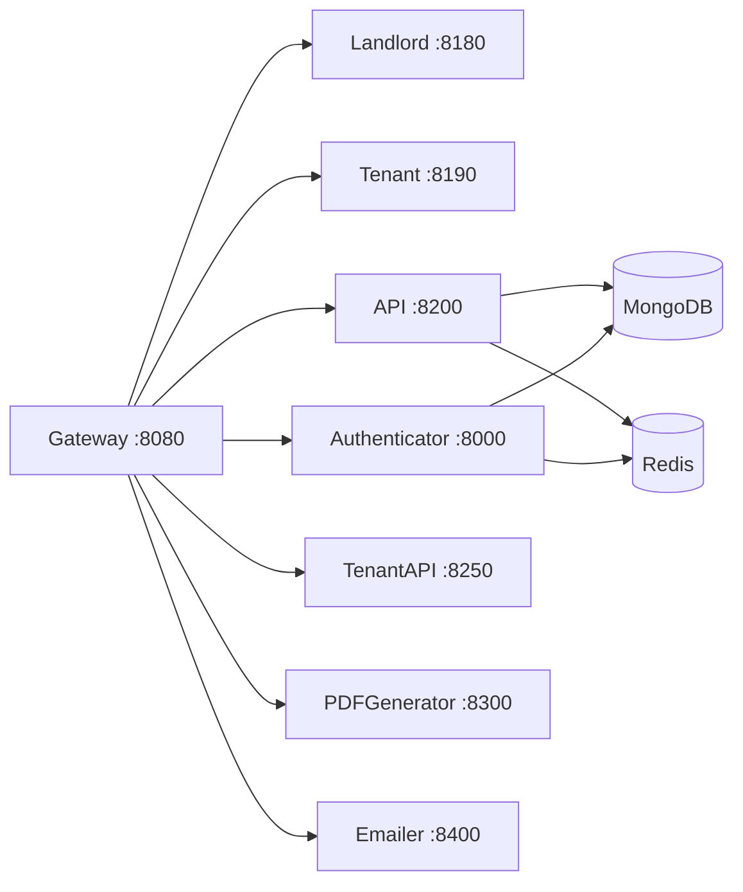

# AGENTS.md — MicroRealEstate

> Open-source property management application for landlords. Microservices architecture, Node.js/TypeScript backend, Next.js frontends, MongoDB, Redis, Docker.

> **Single source of truth.** Agent-readable docs live in `.kiro/steering/`. Other tools read the same content via symlinks (`CLAUDE.md` → this file; `wasabi-toolbag/content/0N-*.md` → the 7 steering files). When updating documentation, edit the steering file. Never edit a symlink.

## Working principles for agents — read before debugging

When a live issue is reported (CORS error, login failure, deployment failure, container crash, etc.), **read the relevant code before proposing a fix.** Pattern-matching on log lines and error messages alone produces wrong answers fast and costs the user trust slowly.

The minimum sequence:

1. **Read the file emitting the error** — find the function that produced the message, read its full logic, and trace its inputs (env vars, config, imports). Do not skim.
2. **Read the helpers it depends on** — if the function uses `URLUtils.destructUrl()`, `bcrypt.compare()`, `jwt.verify()`, or any other shared utility, open that file too. The bug is often in the helper, not the caller.
3. **Verify your hypothesis with a read-only command** before changing anything — `curl` the endpoint with the exact `Origin`/`Authorization` headers, `mongo` query the actual record, `printenv` the running container.
4. **Then** propose a fix. State the root cause in one sentence and the proposed change in one sentence before editing files.

**Anti-patterns to avoid:**
- "Stale cookie" / "rate limit" / "cache" as default explanations when you haven't verified them. Check the logs for the specific request first.
- Patching env vars or config without reading the code that consumes them.
- Restarting services repeatedly hoping the symptom changes.
- Claiming a fix worked without re-running the failing command end-to-end.

If you cannot reproduce or verify a claim within 2-3 read commands, ask the user before continuing — it is cheaper than guessing wrong three times in a row.

## Table of Contents

- [Directory Map](#directory-map) — where to find code
- [Service Topology](#service-topology) — how services connect
- [Key Entry Points](#key-entry-points) — where to start reading
- [Data Layer](#data-layer) — models and naming gotchas
- [Frontend Patterns](#frontend-patterns) — landlord app conventions
- [API Routes](#api-routes) — REST endpoint overview
- [Authentication](#authentication) — JWT flow and middleware
- [Repo-Specific Tooling](#repo-specific-tooling) — scripts, CI, linting
- [Detailed Documentation](#detailed-documentation) — deep-dive files
- [Custom Instructions](#custom-instructions) — human/agent-maintained conventions

## Directory Map

```
microrealestate/
├── services/
│   ├── common/          # Shared library: Service class, Mongoose collections, middleware, crypto
│   ├── gateway/         # Reverse proxy (:8080) — single entry point
│   ├── authenticator/   # JWT auth, bcrypt, password reset, OTP (:8000)
│   ├── api/             # Landlord REST API (:8200)
│   │   ├── src/businesslogic/  # Rent computation pipeline (7 steps)
│   │   ├── src/managers/       # Data access layer (includes greekleaseparser, pdfimportmanager)
│   │   └── src/routes.ts       # All API route definitions
│   ├── tenantapi/       # Tenant read-only API (:8250)
│   ├── emailer/         # Email via Gmail/Mailgun/SMTP (:8400)
│   ├── pdfgenerator/    # PDF generation via Puppeteer (:8300)
│   └── resetservice/    # DB reset + seed (DEV/CI only, :8900)
├── webapps/
│   ├── landlord/        # Next.js 14 Pages Router (JavaScript)
│   │   ├── src/pages/[organization]/  # Org-scoped routes
│   │   ├── src/components/            # Feature + ui/ (shadcn)
│   │   ├── src/hooks/                 # React Query hooks
│   │   ├── src/store/                 # Auth/session classes
│   │   └── src/utils/                 # restcalls.js, fetch.js
│   ├── tenant/          # Next.js 14 App Router (TypeScript)
│   └── commonui/        # Shared utilities, locales, runtime scripts
├── types/               # Shared TypeScript types (CollectionTypes namespace)
├── e2e/                 # Cypress 14 E2E tests
├── cli/                 # CLI tool (dev/build/start/stop)
├── base.env             # Default env vars (versioned)
└── .env                 # Local secrets (not versioned)
```

## Service Topology



Gateway routing order (first match wins):
1. `/api/v2/authenticator/*` → Authenticator
2. `/api/v2/documents/*`, `/api/v2/templates/*` → PDFGenerator
3. `/api/v2/*` → API (catch-all)
4. `/tenantapi/*` → TenantAPI
5. `/api/reset/*` → ResetService (non-prod)
6. `/landlord/*` → Landlord Frontend
7. `/tenant/*` → Tenant Frontend

## Key Entry Points

| To understand... | Start at |
|------------------|----------|
| Service bootstrap | `services/common/src/utils/service.ts` — shared `Service` singleton |
| API routes | `services/api/src/routes.ts` — all landlord API endpoints |
| Rent computation | `services/api/src/businesslogic/` — 7-step pipeline |
| Auth middleware | `services/common/src/utils/middlewares.ts` — `needAccessToken`, `checkOrganization` |
| Gateway proxy | `services/gateway/src/index.ts` — route-to-service mapping |
| Landlord app pages | `webapps/landlord/src/pages/[organization]/` — org-scoped routes |
| Store/auth context | `webapps/landlord/src/store/` — Organization, User, AppHistory classes |
| API call layer | `webapps/landlord/src/utils/restcalls.js` — all API functions |
| Axios interceptor | `webapps/landlord/src/utils/fetch.js` — token refresh logic |
| Mongoose models | `services/common/src/collections/` — all collection schemas |
| TypeScript types | `types/src/common/collections.ts` — `CollectionTypes` namespace |

## Data Layer

**Collections** (in `services/common/src/collections/`): Account, Realm, Tenant (Occupant), Property, Lease, Template, Document, Email.

**Critical naming gotcha:** The Mongoose model for tenants is registered as `'Occupant'` (`mongoose.model('Occupant', ...)`), but TypeScript types and API routes use `Tenant`. When querying MongoDB directly, use `Occupant`.

**Multi-tenancy:** All data is scoped by `realmId`. The `checkOrganization` middleware resolves the Realm from the `organizationId` request header and attaches it to `req`. Every downstream query filters by `realmId`.

**Rent terms** use `YYYYMMDDHH` format (e.g., `2026040100` for April 2026). Rent history is embedded in `tenant.rents[]` — not a separate collection.

## Frontend Patterns

The landlord app has completed migration from Material UI v4 → shadcn/ui + Tailwind, Formik + Yup → react-hook-form + zod, and MobX → React Query. Follow these patterns for all new code:

| Concern | Use | Avoid |
|---------|-----|-------|
| Server state | `@tanstack/react-query` (`useQuery`, `useMutation`) | Direct fetch, MobX stores |
| Auth/session | `StoreContext` (plain classes + `useSyncExternalStore`) | MobX, global state |
| Forms | `react-hook-form` + `zod` + `zodResolver` | Formik, Yup |
| UI components | `src/components/ui/` (shadcn/ui) + Tailwind | `@material-ui/*` |
| API calls | `apiFetcher()` from `src/utils/fetch.js` | Direct axios |

**Store reactivity:** Store classes use `subscribe(listener)` / `notify()`. `InjectStoreContext` uses `useSyncExternalStore`. `withAuthentication` and `useFillStore` read from `getStoreInstance()` singleton (not `useContext`) to avoid timing issues.

**New pages** go in `src/pages/[organization]/`. Feature components in `src/components/<feature>/`. React Query hooks in `src/hooks/`.

## API Routes

All landlord API routes are prefixed `/api/v2/` and require `Authorization: Bearer {token}` + `organizationId` header.

**Referential integrity enforced:**
- DELETE property → 422 if occupied by tenant
- DELETE lease → 422 if used by tenants
- DELETE tenant → 422 if has recorded payments

For the complete endpoint reference, read `services/api/src/routes.ts` and the matching route handlers under `services/api/src/`.

## Authentication

- **Landlord:** JWT access token (Bearer header) + refresh token (cookie). Access tokens ~5min, refresh tokens in Redis.
- **Tenant:** OTP via email → `sessionToken` cookie.
- **Middleware chain:** `needAccessToken` → `checkOrganization` → role checks.
- **Principal types:** `user`, `application`, `service`. **Roles:** `administrator`, `renter`, `tenant`.

## Repo-Specific Tooling

**Yarn 3.3.0 (Berry)** with PnP disabled. Monorepo with Yarn Workspaces.

**Pre-commit hook** (Husky): runs `yarn lint` which triggers ESLint + Prettier on staged files.

**ESLint config** (`.eslintrc.json`): `eslint:recommended` + `plugin:import/recommended` + `prettier`. Enforces sorted imports, single quotes, semicolons, unix line endings.

**Prettier** (`.prettierrc.json`): `semi: true`, `tabWidth: 2`, `singleQuote: true`, `trailingComma: "none"`.

**Docker Compose overlays:**
- `docker-compose.microservices.base.yml` — all service definitions
- `docker-compose.microservices.dev.yml` — volume mounts, hot reload
- `docker-compose.microservices.prod.yml` — restart policies, resource limits
- `docker-compose.microservices.test.yml` — adds resetservice
- `docker-compose.yml` — standalone with Caddy (auto HTTPS)

**CI** (`.github/workflows/ci.yml`): push to `master` → lint → build & push 8 Docker images to GHCR (parallel). The fork strips upstream's deploy and e2e jobs; the canonical upstream pipeline (9 images including tenant-frontend, plus deploy → health check → Cypress E2E) is preserved on `microrealestate/microrealestate`.

For NAS deployment specifics, see `documentation/DEV_AND_DEPLOY.md`.

**TypeScript build order:** `types` → `common` → individual services (each has its own `tsconfig.json`).

**Container runtime note:** Local development uses `finch` (not Docker). All compose commands use `finch compose`.

## Detailed Documentation

For deep dives, the maintained source of truth lives under `.kiro/steering/` and `documentation/`:

| File | Contents |
|------|----------|
| [`.kiro/steering/project-overview.md`](.kiro/steering/project-overview.md) | Repo structure, workspace packages, key commands, branches |
| [`.kiro/steering/tech-stack.md`](.kiro/steering/tech-stack.md) | Runtime, package versions, backend/frontend libraries |
| [`.kiro/steering/architecture-patterns.md`](.kiro/steering/architecture-patterns.md) | Service bootstrap, auth flow, multi-tenancy, frontend gotchas |
| [`.kiro/steering/architecture-diagrams.md`](.kiro/steering/architecture-diagrams.md) | Mermaid diagrams: system, dependencies, auth flow, ER, CI |
| [`.kiro/steering/frontend-patterns.md`](.kiro/steering/frontend-patterns.md) | UI/state/forms patterns + SSR gotchas for the landlord app |
| [`.kiro/steering/roadmap-hardening.md`](.kiro/steering/roadmap-hardening.md) | Phase status, completed and pending items |
| [`.kiro/steering/test-running-guide.md`](.kiro/steering/test-running-guide.md) | Cypress + jest commands, container management, Finch cleanup |
| [`documentation/DEV_AND_DEPLOY.md`](documentation/DEV_AND_DEPLOY.md) | Two-branch dev/NAS workflow, deploy script, troubleshooting |
| [`documentation/FINCH_SETUP.md`](documentation/FINCH_SETUP.md) | Finch installation, env config, disk-space reclaim |
| [`documentation/LINT_DEBT.md`](documentation/LINT_DEBT.md) | Open lint debt with concrete fix plan |
| [`documentation/DEVELOPER.md`](documentation/DEVELOPER.md) | Upstream-style developer guide (Docker, debug, e2e) |

## Custom Instructions

<!-- This section is maintained by developers and agents during day-to-day work.
     Add project-specific conventions, gotchas, and workflow requirements here. -->
