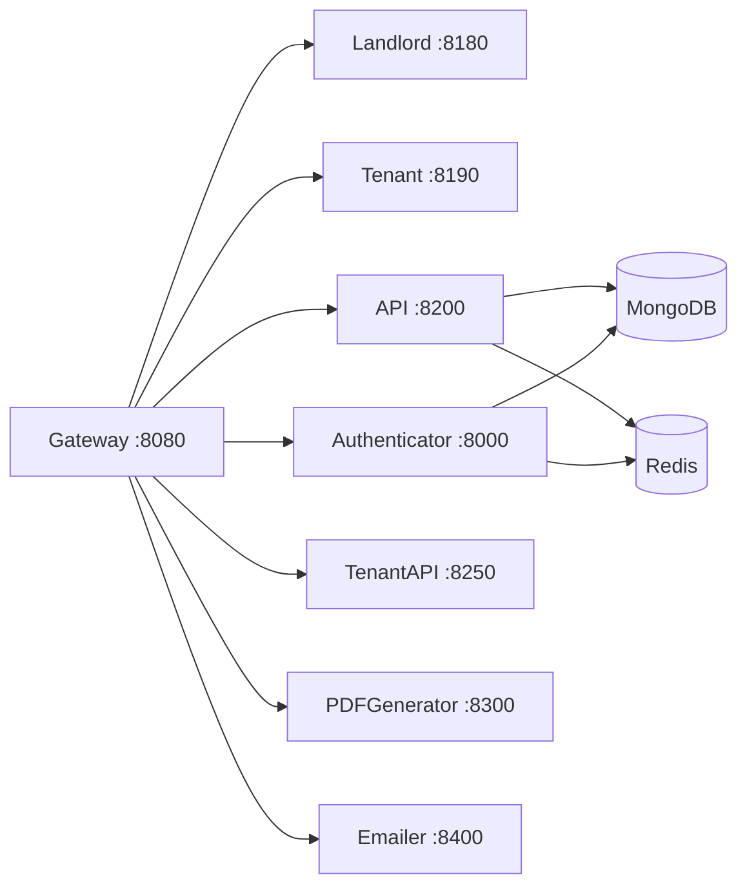

# AGENTS.md — MicroRealEstate

> Open-source property management application for landlords. Microservices architecture, Node.js/TypeScript backend, Next.js frontends, MongoDB, Redis, Docker.

> **Single source of truth.** Agent-readable docs live in `.kiro/steering/`. Other tools read the same content via symlinks (`CLAUDE.md` → this file; `wasabi-toolbag/content/0N-*.md` → the 7 steering files). When updating documentation, edit the steering file. Never edit a symlink.

## STOP — THIS REPOSITORY IS PUBLIC

`github.com/directorscut82/microrealestate` is a **public** repo. Every commit you push is a
publication, and **pushing is irreversible**: GitHub keeps objects fetchable by SHA after a
force-push, and a `refs/pull/N/head` ref pins them permanently — no rewrite and no Support request
removes them. This repo has already published a landlord's family PII and a live third-party
credential. Both incidents were caused by an agent.

Non-negotiable, before any `git` write:

1. **Never `git add -A` / `git add .` / `git commit -a`.** Stage explicit paths. One `add -A` swept a
   real ΔΕΗ bill PDF (7 MB, named account holder, provision number) into a public commit.
2. **Never put real data in a fixture, mockup, comment, spec or doc.** Synthetic values exist for
   this: the `9990000xx` ΑΦΜ band and `ΟΔΟΣ ΑΛΦΑ/ΒΗΤΑ/ΓΑΜΑ` street placeholders.
3. **Never hardcode a credential**, and specifically never as a form `defaultValue` — Next.js
   compiles it into the **client bundle**, so it is served to every browser. That is how a live
   sms-gate.app password went out for 3.5 months. Config belongs in `realm.thirdParties` (AES-256-GCM
   encrypted at rest) or env; real values live only in `.secrets/` (gitignored, never committed).
4. **Real documents (bills, contracts, E9 statements) stay outside the repository.**
5. **Two guards are wired in and must not be bypassed** — `PII_SCAN_SKIP=1` exists but using it to
   make a commit go through is prohibited:
   - `.husky/pre-commit` → `scripts/scan-pii.mjs` scans the **staging area**
   - `.husky/pre-push` → `scripts/scan-push.mjs` scans the **commit trees** being pushed
6. **When asked whether a secret or PII is present, examine the TREE, not the diff.** A secret
   introduced in commit A and still present at Z appears in **A's diff only**, yet Z's tree still
   serves it. Every audit that looked at diffs reported clean while the credential was live. This
   single distinction is why the exposure lasted months.
7. **Never report absence you have not measured.** "No credentials in history" was asserted from
   `git log -- '.secrets/*'`, which can only prove the *directory* was never committed — it cannot
   see a value pasted into application code. State what you enumerated, or say you don't know.

Full incident record, the corrected facts, and what is still exposed:
[`documentation/PII_INCIDENT_2026_07_31.md`](documentation/PII_INCIDENT_2026_07_31.md).

**Currently unresolved:** a live sms-gate.app credential remains fetchable from `origin/nas`,
`origin/master` and `refs/pull/1/head`. Rotation is the only remedy and has not been authorized. Do
not describe it as fixed.

## STOP — fix discipline applies on every bug report

If the user is reporting a bug or asking for a fix in this session, the FIRST thing to load and follow is [`.kiro/steering/fix-discipline-do-not-skip.md`](.kiro/steering/fix-discipline-do-not-skip.md). Not this section, not the steering docs, not the test-running guide — that document. It exists because the agent has a documented multi-day track record of skipping the read-existing-system step, proposing options that silently regress prior work, and deploying without authorization. Read it. Follow Step 0. Don't propose anything before you've shown your reading.

## STOP — UI work is NOT done until you have LOOKED at the rendered Greek screen

If your task touches any UI surface, read [`.kiro/steering/ui-review-do-not-skip.md`](.kiro/steering/ui-review-do-not-skip.md) FIRST. A green Playwright suite asserting API/JSON values is **not** a UI review and must never be reported as one. You must screenshot the surface in the realm's actual locale (`/landlord/el/...`, NOT `/en`), read the image, and triple-review every state including dropdowns and dialogs (defect catalogue → DESIGN.md/mockup conformance → adversarial/no-regression). The word "clean" is banned until you have looked. **Never delete information or regress a feature to make a layout fit** — redesign the container to hold the data. **When the user specifies layout order (e.g. "Επισκευές goes BEFORE the dates and the right panel"), that is a spec, not a suggestion.** Open every dropdown/select and confirm the options are DISTINCT and correctly labelled (a select that renders identical options is a shipped bug). This document exists because the agent reviewed English (wrong language), called surfaces "clean" without looking, ignored explicit layout instructions, shipped identical dropdown options, raw `{{year}}` strings, black-blob bars, banned card grids, and inconsistent Greek across a whole weekend of being told to review the UI.

## Working principles for agents — read before debugging

When a live issue is reported (CORS error, login failure, deployment failure, container crash, etc.), **read the relevant code before proposing a fix.** Pattern-matching on log lines and error messages alone produces wrong answers fast and costs the user trust slowly.

The minimum sequence:

1. **Read the file emitting the error** — find the function that produced the message, read its full logic, and trace its inputs (env vars, config, imports). Do not skim.
2. **Read the helpers it depends on** — if the function uses `URLUtils.destructUrl()`, `bcrypt.compare()`, `jwt.verify()`, or any other shared utility, open that file too. The bug is often in the helper, not the caller.
3. **Verify your hypothesis with a read-only command** before changing anything — `curl` the endpoint with the exact `Origin`/`Authorization` headers, `mongo` query the actual record, `printenv` the running container.
4. **Then** propose a fix. State the root cause in one sentence and the proposed change in one sentence before editing files.

**Anti-patterns to avoid:**
- "Stale cookie" / "rate limit" / "cache" as default explanations when you haven't verified them. Check the logs for the specific request first.
- Patching env vars or config without reading the code that consumes them.
- Restarting services repeatedly hoping the symptom changes.
- Claiming a fix worked without re-running the failing command end-to-end.

If you cannot reproduce or verify a claim within 2-3 read commands, ask the user before continuing — it is cheaper than guessing wrong three times in a row.

## Quick triage: signin returns HTTP 500 locally

This is the #1 local-dev failure. The cookie/rate-limit theory is almost always wrong — start here instead.

1. **Check gateway logs first**: `finch logs microrealestate-gateway-1 2>&1 | grep -iE "cors|error" | tail -10`
2. If you see `CORS blocked origin: http://localhost:8080`: open `.env`, ensure `APP_DOMAIN=localhost:8080` is present, then **recreate** the gateway (don't just restart — `finch restart` does NOT reload env vars):
   ```
   finch rm -f microrealestate-gateway-1
   finch compose -f docker-compose.microservices.base.yml -f docker-compose.microservices.dev.yml up -d gateway
   ```
3. If you don't see CORS errors but the gateway is unreachable: verify `API_URL=http://api:8200/api/v2` is in `.env` (gateway crashes silently without it).
4. If credentials really don't match (auth code is reached but fails): the bcrypt hash in `accounts` collection may be from before the May 2026 double-hash fix. Reset directly in mongo — see `services/api/src/businesslogic/` for the bcrypt utility, or run `bcrypt.hash(password, 10)` inside the authenticator container and `db.accounts.updateOne(...)` inside mongo.

For a general "HTTP 500 from gateway" decision tree, see `.kiro/steering/test-running-guide.md`.

## Definition of "done" — read EVERY session before declaring anything fixed

**Nothing is fixed/working/shipped/verified until a Playwright browser drives the actual user flow against the deployed NAS UI and the assertions hold.** A green suite count is NOT proof. Manual browser spot-check (open http://192.168.0.96:1350/landlord/, sign in, do the thing) beats every test run. Existence assertions like `toBeVisible()` on a row that is also visible in the unfiltered list are tautologies, not coverage — use `toHaveCount(N)` or value-delta. Surfaces that need refetch-resilience coverage (type → wait → re-assert) are listed in `.kiro/steering/test-running-guide.md` "Definition of done"; ship the spec in the same PR as the change or the change is not done.

If you find yourself saying "the suite passes, it's working" — open the app in a browser first. The user has had to ask for this >20 times in this codebase. Don't make it 21.

### A spec is not a spec until it has run green on the live NAS

This rule exists because the cycle "agent claims X tests written → 50% fail when run → agent says it's spec infra issues → next session repeats" has burned weeks across multiple sessions. Read `.kiro/steering/test-running-guide.md` "MANDATORY pre-merge checklist for every new spec" and `documentation/E2E_TESTING.md` "Hard rule: a spec is not a spec until it runs green on real data" BEFORE authoring any test. Counting un-run tests as coverage is forbidden. If a test needs infra that doesn't exist (mongo backdoor seeder, real PDF fixtures, ephemeral-realm-with-correct-signin pattern), BUILD THE INFRA FIRST — do not paper over its absence with stub specs. **Real-data scenarios (multi-property tenants, partially-corrupt legacy rows) MUST seed via `mongoExec` direct insert, not via API POST — the API correctly rejects bad data, that's the validators doing their job.**

## June 2026 — Recent state of play

Multi-day debugging session left the following lessons that future agents must internalize before changing anything:

### Timezone is the single most-bitten gotcha in this codebase

The Playwright suite, the seed helpers, the form-side date guards, and the server-side date guards all do `moment.utc(...)` vs `moment(...)` (local). On Athens (UTC+2 winter / UTC+3 summer) these can disagree by a calendar day at midnight or near month boundaries. Mismatches in either direction cause silent test failures or 422 rejections that look like app bugs.

**Rule:** if you see two `moment(...)` calls in the same comparison, BOTH must use `moment.utc(...)` OR neither — never mix. Anchors:

- `services/api/src/managers/rentmanager.ts` F3 guard — uses `moment.utc(p.date, 'DD/MM/YYYY', true)` AND `moment.utc(termFirstDay,'YYYY-MM-DD', true)` — consistent ✓
- `webapps/landlord/src/components/payment/PaymentTabs.js` `_handleSubmit` — fixed in `35af8ec0`: both sides UTC ✓. Anchors as of 2026-08-02: `_handleSubmit` at `:459`, `_parsed = moment.utc(...)` at `:506`, `_termFirstDay` at `:495`, the comparison at `:508-511`. These have drifted every time the file was touched (previously cited 457/503/489) — `grep -n '_termFirstDay\|_parsed = moment' <file>` instead of trusting the numbers.
- `e2e-playwright/tests/lib/api.ts` `ensureSeedLeasedTenantWithPayment` — uses `getMonth()` / `getFullYear()` (LOCAL) so the URL term matches the test's UI navigation (also LOCAL) ✓

If any of those drift back to mismatch, **every payment dialog test will time out at 15-22s** because the client-side guard fires a "Payment date is before this rent month" toast and the PATCH never goes out. That's exactly what happened in suites #7-#10 (June 1).

### The `64da4117 → ee4a4b10 → 76fd42e6` saga (do NOT repeat)

The `submittingRef` + 80ms `setTimeout` fallback lives in **`webapps/landlord/src/components/payment/NewPaymentDialog.js:79-94`** — the OUTER dialog, *not* `PaymentTabs.js` (grep confirms `submittingRef` appears nowhere in PaymentTabs; the docs have implied otherwise). It resets the ref if `formRef.isSubmitting()` reports false, to recover from zod-rejected submits where neither `onSubmit` nor `onError` fires and the button would sit in "Saving" forever. **Do not "tighten" or remove this timeout** — every attempt has broken the entire dialog flow. The 80ms value was load-bearing in the working-suite-6 baseline. The double-click race that C28 catches is a known edge case; accept the flake rather than drag the rest of the form down with you. `UncollectedPaymentDialog.js:35` carries the same guard — a sibling to check if you touch this pattern.

### Test seed leakage cascade

Spec 19 (lifecycle scenarios) creates fixtures (E2E-LeasedTenant-B) AND mutates the canonical fixture (sets `terminationDate` in L02). When a test panics mid-flow, the `afterAll` cleanup may not run. Subsequent suites then find:

1. **A second tenant whose name has E2E-LeasedTenant as a prefix** — substring-match selectors (`hasText: 'E2E-LeasedTenant'`) lock onto the wrong tenant. Use `:text-is("...")` for exact match.
2. **The canonical tenant terminated** — the tenant disappears from current+future rent grids. The Mongoose `update` path doesn't `$unset` cleanly when you PATCH `terminationDate: null`; you must drop directly into mongo and run `$unset: {terminationDate: ""}`. The `mre-mongo-1` container is mongo 4.4 (`mongo` shell, not `mongosh`).

If a Playwright run leaves the realm dirty, fix it via mongo before re-running. There is no `DELETE /api/reset` on NAS.

### The deploy script's bash exit-0 is a lie

`yarn deploy:nas` runs in the foreground (CI-wait poll + image pull + Portainer stack update + container revision verification). When you `&` it to background, bash returns exit 0 the moment it backgrounds — the actual deploy is still running. Always verify by polling Portainer for the container revision instead of trusting the exit code:

```bash
PT=$(cat .secrets/portainer-token)
curl -s "http://192.168.0.96:9000/api/endpoints/3/docker/containers/json?all=true" -H "X-API-Key: $PT" \
  | jq -r '.[] | select(.Names[0] | test("landlord-frontend")) | .Labels."org.opencontainers.image.revision"' \
  | cut -c1-8
```

Run that to confirm NAS is on the commit you pushed BEFORE running tests.

### Current state (August 2, 2026)

- **jest baseline: 883 passed / 17 skipped / 900 total, 54 of 55 suites passed + 1 skipped, 0 failed** (node@20, ~12.7s; 55 api test files on disk). Every older figure below (431, 609, ~628, 644, 875) is a point-in-time snapshot — **re-run, don't quote**. A count that DROPS is a deleted/skipped test, not a pass.
- **NAS is UP** (measured 2026-08-02: `landlord/el/signin` → 200, portainer → 200; 15/16 containers running, all 8 app containers on revision `752e6e20`). **The July-31 "NAS is UNREACHABLE, anything needing it is OWED" line is withdrawn** — it had become a standing excuse to skip the Playwright gate and the Greek-screen UI review. Both gates are runnable; run them.
- **History was rewritten 2026-08-01** (`git filter-repo`, PII scrub) — every commit SHA changed. SHA citations in these docs were re-pointed on 2026-08-02, but any SHA in an older commit message, memory file, or transcript is suspect. Verify with `git cat-file -e <sha>^{commit}`; an abbreviated SHA may now resolve to a *different* object.
- **⚠️ A live sms-gate.app credential is still public** — reachable from `origin/nas`, `origin/master`, and pinned permanently by `refs/pull/1/head`. No rewrite and no Support ticket can retract it; rotation is the only remedy and has **not** been authorized. Do not describe it as fixed. See [`documentation/PII_INCIDENT_2026_07_31.md`](documentation/PII_INCIDENT_2026_07_31.md).
- **Bill-OCR branch: Slices 1–6 shipped; Slice 3 (ΕΥΔΑΠ/ΕΠΑ providers) blocked on sample bills.** A 2026-07 audit of the shipped code produced **7 fixes, code-complete + tested + mutation-verified, sitting UNCOMMITTED in the working tree** (18 modified + 3 new files). Three of the seven were the same bug in three places: **an idempotency key containing a server-defaultable field.** One (OVERPAY) was an *absent representation* — no enum value, a `Math.max(0,…)` clamp, and two `status:{$in:[...]}` filters meant overpaid money left no trace on any surface. Full record + the design-was-wrong notes: `documentation/BILL_OCR_INBOX_PLAN.md` §16. Rules extracted into `documentation/MONEY_SURFACE_MATRIX.md` (absent representation, idempotency keys, directional tolerances) and `.kiro/steering/test-running-guide.md` (mutation-test your own tests, mock-factory `...real` trap).

### Shipped-work archive (June 1 – July 13, 2026) — collapsed 2026-08-02

This section used to be ~50 lines of dated release notes: NAS revisions, jest counts, and
per-batch changelogs for the June money/building work, the July 1 money-UI + PDF bundle, and the
July 1–13 third-party-services run. It was **stale by construction** — every revision and count in
it was superseded by the block above, and it sat *above* the reference sections, so it was the
first thing read every session. Collapsed; the durable content lives where it can't rot:

| What was recorded here | Where it lives now |
|---|---|
| Money-surface invariants, dual-role rule, per-surface query keys | `documentation/MONEY_SURFACE_MATRIX.md` |
| jest node@20 + `.cjs` mock infra, the `unstable_mockModule` must-mock-every-export trap | `.kiro/steering/test-running-guide.md` § "Running unit tests" |
| Behaviours confirmed correct that must not be "fixed" (`_isFrozen`, `submittingRef`, `destructUrl`, pie math, allocation order) | `.kiro/steering/test-running-guide.md` § "Behaviours verified correct as-is" |
| Third-party channel config + disaster-recovery back-fill | `documentation/THIRD_PARTY_SERVICES_SETUP.md` |
| Bill-OCR slices + the 2026-07 audit's 7 fixes | `documentation/BILL_OCR_INBOX_PLAN.md` §16 |
| Open items, per-phase status | `.kiro/steering/roadmap-hardening.md` § "What is actually still open" |

Four mechanisms from that run are load-bearing and are documented **in the code itself**, so a
future change has to read past the comment to break them:

- **`inputAmount`** — the landlord-typed statement figure, kept beside the per-unit `amount` so
  repeated saves can't sum-erode a variable expense toward zero. Schema comment:
  `services/common/src/collections/building.ts:28-37`.
- **Stock tailwind-merge stays stock** — the "huge pills" fix is an arbitrary-value size class in
  `webapps/landlord/src/components/ui/badge.js:24-31`; the app-wide blast radius of teaching `cn()`
  the custom tokens is written up at the top of `webapps/landlord/src/utils/index.js:5-14`.
- **`optimisticConcurrency: true`** on Building / Realm / Tenant (`grep -rn optimisticConcurrency
  services/common/src/collections/`) — the correctness mechanism standing in for MongoDB
  transactions, which the single-node NAS deployment cannot provide.
- **The PDF calc-basis is correct-or-absent** — `services/common/src/utils/sharebasis.ts` (shared by
  api and pdfgenerator, moment-free) plus the internal-consistency backstop in
  `services/pdfgenerator/templates/partials/invoicebody.ejs:53` (`formatBasis`), which renders NO
  sub-line rather than a false equation. Two arithmetically-false equations shipped past a green
  jest suite AND a static-HTML mock here; both were caught only by generating and reading the real
  PDF. See [[project_pdf_basis_render_real_artifact]].

Everything else is recoverable from `git log`. Do not re-expand this section — a changelog in an
always-loaded steering doc is a changelog nobody can trust.

## Table of Contents

- [Directory Map](#directory-map) — where to find code
- [Service Topology](#service-topology) — how services connect
- [Key Entry Points](#key-entry-points) — where to start reading
- [Data Layer](#data-layer) — models and naming gotchas
- [Frontend Patterns](#frontend-patterns) — landlord app conventions
- [API Routes](#api-routes) — REST endpoint overview
- [Authentication](#authentication) — JWT flow and middleware
- [Repo-Specific Tooling](#repo-specific-tooling) — scripts, CI, linting
- [Detailed Documentation](#detailed-documentation) — deep-dive files
- [Custom Instructions](#custom-instructions) — human/agent-maintained conventions

## Directory Map

```
microrealestate/
├── services/
│   ├── common/          # Shared library: Service class, Mongoose collections, middleware, crypto
│   ├── gateway/         # Reverse proxy (:8080) — single entry point
│   ├── authenticator/   # JWT auth, bcrypt, password reset, OTP (:8000)
│   ├── api/             # Landlord REST API (:8200)
│   │   ├── src/businesslogic/  # Rent computation pipeline (7 steps)
│   │   ├── src/managers/       # Data access layer (includes greekleaseparser, pdfimportmanager)
│   │   └── src/routes.ts       # All API route definitions
│   ├── tenantapi/       # Tenant read-only API (:8250)
│   ├── emailer/         # Multi-channel notifications: Email (Gmail/Mailgun/SMTP), SMS (sms-gate.app), Telegram (:8400)
│   ├── pdfgenerator/    # PDF generation via Puppeteer (:8300)
│   └── resetservice/    # DB reset + seed (DEV/CI only, :8900)
├── webapps/
│   ├── landlord/        # Next.js 14 Pages Router (JavaScript)
│   │   ├── src/pages/[organization]/  # Org-scoped routes
│   │   ├── src/components/            # Feature + ui/ (shadcn)
│   │   ├── src/hooks/                 # React Query hooks
│   │   ├── src/store/                 # Auth/session classes
│   │   └── src/utils/                 # restcalls.js, fetch.js
│   ├── tenant/          # Next.js 14 App Router (TypeScript)
│   └── commonui/        # Shared utilities, locales, runtime scripts
├── types/               # Shared TypeScript types (CollectionTypes namespace)
├── e2e-playwright/      # Playwright E2E tests (NAS-targeted)
├── cli/                 # CLI tool (dev/build/start/stop)
├── base.env             # Default env vars (versioned)
└── .env                 # Local secrets (not versioned)
```

## Service Topology


```mermaid
graph LR
    GW[Gateway :8080] --> LF[Landlord :8180]
    GW --> TF[Tenant :8190]
    GW --> Auth[Authenticator :8000]
    GW --> API[API :8200]
    GW --> TAPI[TenantAPI :8250]
    GW --> PDF[PDFGenerator :8300]
    GW --> Email[Emailer :8400]
    API --> MongoDB[(MongoDB)]
    API --> Redis[(Redis)]
    Auth --> MongoDB
    Auth --> Redis
```

Gateway routing order (first match wins):
1. `/api/v2/authenticator/*` → Authenticator
2. `/api/v2/documents/*`, `/api/v2/templates/*` → PDFGenerator
3. `/api/v2/*` → API (catch-all)
4. `/tenantapi/*` → TenantAPI
5. `/api/reset/*` → ResetService (non-prod)
6. `/landlord/*` → Landlord Frontend
7. `/tenant/*` → Tenant Frontend

## Key Entry Points

| To understand... | Start at |
|------------------|----------|
| Service bootstrap | `services/common/src/utils/service.ts` — shared `Service` singleton |
| API routes | `services/api/src/routes.ts` — all landlord API endpoints |
| Rent computation | `services/api/src/businesslogic/` — 7-step pipeline |
| Auth middleware | `services/common/src/utils/middlewares.ts` — `needAccessToken`, `checkOrganization` |
| Gateway proxy | `services/gateway/src/index.ts` — route-to-service mapping |
| Landlord app pages | `webapps/landlord/src/pages/[organization]/` — org-scoped routes |
| Store/auth context | `webapps/landlord/src/store/` — Organization, User, AppHistory classes |
| API call layer | `webapps/landlord/src/utils/restcalls.js` — all API functions |
| Axios interceptor | `webapps/landlord/src/utils/fetch.js` — token refresh logic |
| Mongoose models | `services/common/src/collections/` — all collection schemas |
| TypeScript types | `types/src/common/collections.ts` — `CollectionTypes` namespace |

## Data Layer

**Collections — 12** (in `services/common/src/collections/`, all re-exported from `index.ts`): Account, Realm, Tenant (Occupant), Property, Lease, **Building**, **Bill**, **InboxItem**, **TelegramOffset**, Template, Document, Email. Regenerate with `ls services/common/src/collections/` rather than trusting this line — it was missing four of them for months, including the two that back the Telegram bill inbox.

**Backup gap:** `COLLECTIONS_TO_BACKUP` (`services/api/src/managers/databasemanager.ts:13`) names 10 of the 12 — `InboxItem` and `TelegramOffset` are absent, and `accounts` is intentionally emptied for per-realm backups (no `realmId`). A restore therefore loses pending Telegram-inbox bills and resets the poller cursor.

**Critical naming gotcha:** The Mongoose model for tenants is registered as `'Occupant'` (`mongoose.model('Occupant', ...)`), but TypeScript types and API routes use `Tenant`. When querying MongoDB directly, use `Occupant`.

**Multi-tenancy:** All data is scoped by `realmId`. The `checkOrganization` middleware resolves the Realm from the `organizationId` request header and attaches it to `req`. Every downstream query filters by `realmId`.

**Rent terms** use `YYYYMMDDHH` format (e.g., `2026040100` for April 2026). Rent history is embedded in `tenant.rents[]` — not a separate collection.

## Frontend Patterns

The landlord app has completed migration from Material UI v4 → shadcn/ui + Tailwind, Formik + Yup → react-hook-form + zod, and MobX → React Query. Follow these patterns for all new code:

| Concern | Use | Avoid |
|---------|-----|-------|
| Server state | `@tanstack/react-query` (`useQuery`, `useMutation`) | Direct fetch, MobX stores |
| Auth/session | `StoreContext` (plain classes + `useSyncExternalStore`) | MobX, global state |
| Forms | `react-hook-form` + `zod` + `zodResolver` | Formik, Yup |
| UI components | `src/components/ui/` (shadcn/ui) + Tailwind | `@material-ui/*` |
| API calls | `apiFetcher()` from `src/utils/fetch.js` | Direct axios |

**Store reactivity:** Store classes use `subscribe(listener)` / `notify()`. `InjectStoreContext` uses `useSyncExternalStore`. `withAuthentication` and `useFillStore` read from `getStoreInstance()` singleton (not `useContext`) to avoid timing issues.

**New pages** go in `src/pages/[organization]/`. Feature components in `src/components/<feature>/`. React Query hooks in `src/hooks/`.

## API Routes

All landlord API routes are prefixed `/api/v2/` and require `Authorization: Bearer {token}` + `organizationId` header.

**Referential integrity enforced:**
- DELETE property → 422 if occupied by tenant
- DELETE lease → 422 if used by tenants
- DELETE tenant → 422 if has recorded payments

For the complete endpoint reference, read `services/api/src/routes.ts` and the matching route handlers under `services/api/src/`.

## Authentication

- **Landlord:** JWT access token (Bearer header, **15m**) + refresh token (cookie, **1h in production / 12h in dev**), refresh tokens stored in Redis with a matching TTL. Both HS256, algorithm pinned explicitly. The refresh path does an **atomic GET+DEL** to close the concurrent-refresh replay race. (`services/authenticator/src/routes/landlord.ts` `_generateTokens`.) The `300s` / `5m` figures elsewhere are the **app M2M token** and the reset-password token — not the user access token.
- **Tenant:** OTP via email → `sessionToken` cookie (**30m** in production / 12h dev).
- **Rate limiting:** `authRateLimit` — 20 failed attempts / 60s, keyed `email:` → `clientId:` → `ip:`. Successful sign-ins don't consume budget. Applied to landlord `/signup` `/signin` `/apptoken` `/forgotpassword` and tenant `/signin` `/signedin`; deliberately NOT to `/refreshtoken` or `/session`. In-memory and process-local — see tech-stack.md.
- **Middleware chain:** `needAccessToken` → `checkOrganization` → role checks.
- **Principal types:** `user`, `application`, `service`. **Roles:** `administrator`, `renter`, `tenant`.

## Repo-Specific Tooling

**Yarn 3.3.0 (Berry)** with PnP disabled. Monorepo with Yarn Workspaces.

**Pre-commit hook** (Husky): runs `yarn lint` which triggers ESLint + Prettier on staged files.

**ESLint config** (`.eslintrc.json`): `eslint:recommended` + `plugin:import/recommended` + `prettier`. Enforces sorted imports, single quotes, semicolons, unix line endings.

**Prettier** (`.prettierrc.json`): `semi: true`, `tabWidth: 2`, `singleQuote: true`, `trailingComma: "none"`.

**Docker Compose overlays:**
- `docker-compose.microservices.base.yml` — all service definitions
- `docker-compose.microservices.dev.yml` — volume mounts, hot reload
- `docker-compose.microservices.prod.yml` — restart policies, resource limits
- `docker-compose.microservices.test.yml` — adds resetservice
- `docker-compose.yml` — standalone with Caddy (auto HTTPS)

**CI** — **four** workflows build the 9-image matrix (gateway, api, tenantapi, authenticator, pdfgenerator, emailer, resetservice, landlord-frontend, tenant-frontend); **three of them push to GHCR**:
- `.github/workflows/nas-ci.yml` ("NAS Branch CI") — push to **`nas`** → lint → build & push `:nas` (always-latest) + `:nas-<sha>` (pinned for rollback). **This is the workflow that produces the images the NAS deploy pulls** (`scripts/deploy-nas.sh` waits on it).
- `.github/workflows/ci.yml` — push to `master` → lint → build & push `:<sha>` + `:latest`. The fork strips upstream's deploy → health-check → Cypress E2E jobs.
- `.github/workflows/release.yml` — on `release` → build & push `:<release-tag>` **and overwrite `:latest`**. Easy to miss when reasoning "only master and nas publish".
- `.github/workflows/pr-ci.yml` — on `pull_request` → builds the same matrix with `push: false`; never publishes.
- `.github/workflows/codeql-analysis.yml` — analysis only, builds no images.

**E2E on this fork** is Playwright at `e2e-playwright/`, runs against the live NAS (not CI) — see [`documentation/E2E_TESTING.md`](documentation/E2E_TESTING.md).

For NAS deployment specifics, see `documentation/DEV_AND_DEPLOY.md`.

**TypeScript build order:** `types` → `common` → individual services (each has its own `tsconfig.json`).

**Container runtime note:** Local development uses `finch` (not Docker). All compose commands use `finch compose`.

## Detailed Documentation

For deep dives, the maintained source of truth lives under `.kiro/steering/` and `documentation/`:

| File | Contents |
|------|----------|
| [`.kiro/steering/fix-discipline-do-not-skip.md`](.kiro/steering/fix-discipline-do-not-skip.md) | **READ FIRST WHEN ASKED TO FIX A BUG.** Step-by-step fix protocol. Read existing system before proposing anything. No options, no architecture changes, no deploys without authorization. |
| [`.kiro/steering/project-overview.md`](.kiro/steering/project-overview.md) | Repo structure, workspace packages, key commands, branches |
| [`.kiro/steering/tech-stack.md`](.kiro/steering/tech-stack.md) | Runtime, package versions, backend/frontend libraries |
| [`.kiro/steering/architecture-patterns.md`](.kiro/steering/architecture-patterns.md) | Service bootstrap, auth flow, multi-tenancy, frontend gotchas |
| [`.kiro/steering/architecture-diagrams.md`](.kiro/steering/architecture-diagrams.md) | Mermaid diagrams: system, dependencies, auth flow, ER, CI |
| [`.kiro/steering/frontend-patterns.md`](.kiro/steering/frontend-patterns.md) | UI/state/forms patterns + SSR gotchas for the landlord app |
| [`.kiro/steering/roadmap-hardening.md`](.kiro/steering/roadmap-hardening.md) | Phase status, completed and pending items |
| [`.kiro/steering/test-running-guide.md`](.kiro/steering/test-running-guide.md) | Playwright + jest commands, discipline rules, container management |
| [`documentation/E2E_TESTING.md`](documentation/E2E_TESTING.md) | Canonical E2E reference: harness layout, discipline rules, common gotchas |
| [`documentation/DEV_AND_DEPLOY.md`](documentation/DEV_AND_DEPLOY.md) | Two-branch dev/NAS workflow, deploy script, troubleshooting |
| [`documentation/FINCH_SETUP.md`](documentation/FINCH_SETUP.md) | Finch installation, env config, disk-space reclaim |
| [`documentation/LINT_DEBT.md`](documentation/LINT_DEBT.md) | Open lint debt with concrete fix plan |
| [`documentation/DEVELOPER.md`](documentation/DEVELOPER.md) | Upstream-style developer guide (Docker, debug). E2E sections in this doc are stale (refer to upstream Cypress); use `documentation/E2E_TESTING.md` for the actual harness. |

## Custom Instructions

<!-- This section is maintained by developers and agents during day-to-day work.
     Add project-specific conventions, gotchas, and workflow requirements here. -->
