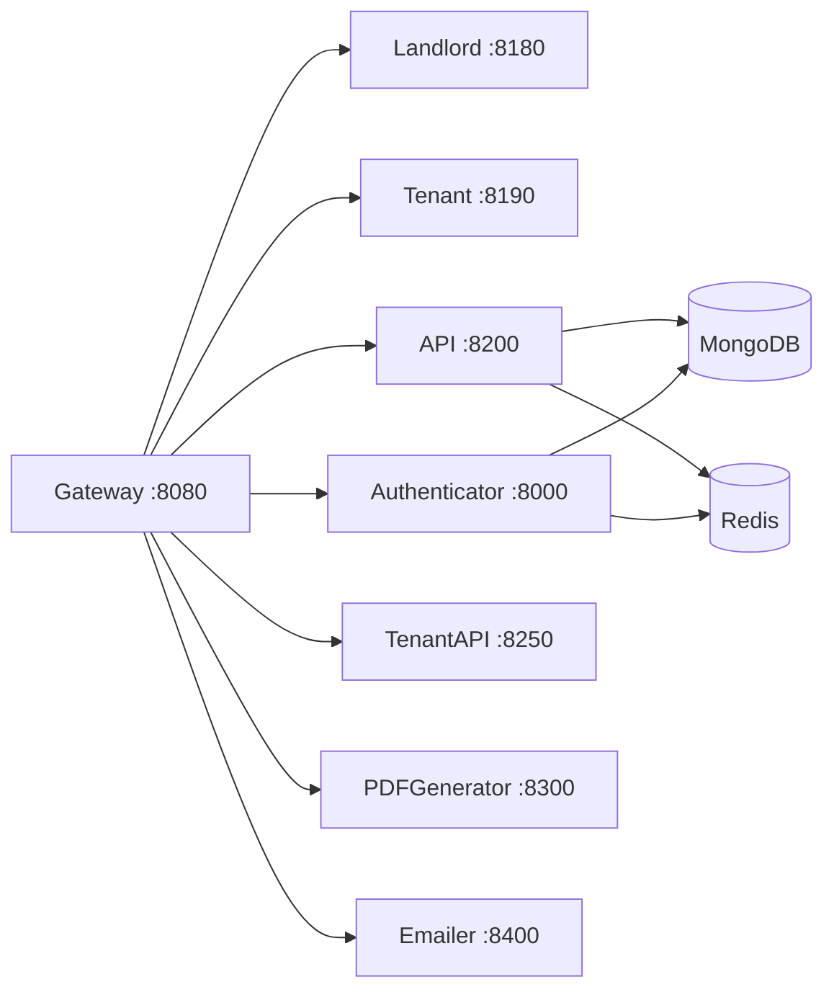

# AGENTS.md — MicroRealEstate

> Open-source property management application for landlords. Microservices architecture, Node.js/TypeScript backend, Next.js frontends, MongoDB, Redis, Docker.

> **Single source of truth.** Agent-readable docs live in `.kiro/steering/`. Other tools read the same content via symlinks (`CLAUDE.md` → this file; `wasabi-toolbag/content/0N-*.md` → the 7 steering files). When updating documentation, edit the steering file. Never edit a symlink.

## STOP — fix discipline applies on every bug report

If the user is reporting a bug or asking for a fix in this session, the FIRST thing to load and follow is [`.kiro/steering/fix-discipline-do-not-skip.md`](.kiro/steering/fix-discipline-do-not-skip.md). Not this section, not the steering docs, not the test-running guide — that document. It exists because the agent has a documented multi-day track record of skipping the read-existing-system step, proposing options that silently regress prior work, and deploying without authorization. Read it. Follow Step 0. Don't propose anything before you've shown your reading.

## STOP — UI work is NOT done until you have LOOKED at the rendered Greek screen

If your task touches any UI surface, read [`.kiro/steering/ui-review-do-not-skip.md`](.kiro/steering/ui-review-do-not-skip.md) FIRST. A green Playwright suite asserting API/JSON values is **not** a UI review and must never be reported as one. You must screenshot the surface in the realm's actual locale (`/landlord/el/...`, NOT `/en`), read the image, and triple-review every state including dropdowns and dialogs (defect catalogue → DESIGN.md/mockup conformance → adversarial/no-regression). The word "clean" is banned until you have looked. **Never delete information or regress a feature to make a layout fit** — redesign the container to hold the data. **When the user specifies layout order (e.g. "Επισκευές goes BEFORE the dates and the right panel"), that is a spec, not a suggestion.** Open every dropdown/select and confirm the options are DISTINCT and correctly labelled (a select that renders identical options is a shipped bug). This document exists because the agent reviewed English (wrong language), called surfaces "clean" without looking, ignored explicit layout instructions, shipped identical dropdown options, raw `{{year}}` strings, black-blob bars, banned card grids, and inconsistent Greek across a whole weekend of being told to review the UI.

## Working principles for agents — read before debugging

When a live issue is reported (CORS error, login failure, deployment failure, container crash, etc.), **read the relevant code before proposing a fix.** Pattern-matching on log lines and error messages alone produces wrong answers fast and costs the user trust slowly.

The minimum sequence:

1. **Read the file emitting the error** — find the function that produced the message, read its full logic, and trace its inputs (env vars, config, imports). Do not skim.
2. **Read the helpers it depends on** — if the function uses `URLUtils.destructUrl()`, `bcrypt.compare()`, `jwt.verify()`, or any other shared utility, open that file too. The bug is often in the helper, not the caller.
3. **Verify your hypothesis with a read-only command** before changing anything — `curl` the endpoint with the exact `Origin`/`Authorization` headers, `mongo` query the actual record, `printenv` the running container.
4. **Then** propose a fix. State the root cause in one sentence and the proposed change in one sentence before editing files.

**Anti-patterns to avoid:**
- "Stale cookie" / "rate limit" / "cache" as default explanations when you haven't verified them. Check the logs for the specific request first.
- Patching env vars or config without reading the code that consumes them.
- Restarting services repeatedly hoping the symptom changes.
- Claiming a fix worked without re-running the failing command end-to-end.

If you cannot reproduce or verify a claim within 2-3 read commands, ask the user before continuing — it is cheaper than guessing wrong three times in a row.

## Quick triage: signin returns HTTP 500 locally

This is the #1 local-dev failure. The cookie/rate-limit theory is almost always wrong — start here instead.

1. **Check gateway logs first**: `finch logs microrealestate-gateway-1 2>&1 | grep -iE "cors|error" | tail -10`
2. If you see `CORS blocked origin: http://localhost:8080`: open `.env`, ensure `APP_DOMAIN=localhost:8080` is present, then **recreate** the gateway (don't just restart — `finch restart` does NOT reload env vars):
   ```
   finch rm -f microrealestate-gateway-1
   finch compose -f docker-compose.microservices.base.yml -f docker-compose.microservices.dev.yml up -d gateway
   ```
3. If you don't see CORS errors but the gateway is unreachable: verify `API_URL=http://api:8200/api/v2` is in `.env` (gateway crashes silently without it).
4. If credentials really don't match (auth code is reached but fails): the bcrypt hash in `accounts` collection may be from before the May 2026 double-hash fix. Reset directly in mongo — see `services/api/src/businesslogic/` for the bcrypt utility, or run `bcrypt.hash(password, 10)` inside the authenticator container and `db.accounts.updateOne(...)` inside mongo.

For a general "HTTP 500 from gateway" decision tree, see `.kiro/steering/test-running-guide.md`.

## Definition of "done" — read EVERY session before declaring anything fixed

**Nothing is fixed/working/shipped/verified until a Playwright browser drives the actual user flow against the deployed NAS UI and the assertions hold.** A green suite count is NOT proof. Manual browser spot-check (open http://192.168.0.96:1350/landlord/, sign in, do the thing) beats every test run. Existence assertions like `toBeVisible()` on a row that is also visible in the unfiltered list are tautologies, not coverage — use `toHaveCount(N)` or value-delta. Surfaces that need refetch-resilience coverage (type → wait → re-assert) are listed in `.kiro/steering/test-running-guide.md` "Definition of done"; ship the spec in the same PR as the change or the change is not done.

If you find yourself saying "the suite passes, it's working" — open the app in a browser first. The user has had to ask for this >20 times in this codebase. Don't make it 21.

### A spec is not a spec until it has run green on the live NAS

This rule exists because the cycle "agent claims X tests written → 50% fail when run → agent says it's spec infra issues → next session repeats" has burned weeks across multiple sessions. Read `.kiro/steering/test-running-guide.md` "MANDATORY pre-merge checklist for every new spec" and `documentation/E2E_TESTING.md` "Hard rule: a spec is not a spec until it runs green on real data" BEFORE authoring any test. Counting un-run tests as coverage is forbidden. If a test needs infra that doesn't exist (mongo backdoor seeder, real PDF fixtures, ephemeral-realm-with-correct-signin pattern), BUILD THE INFRA FIRST — do not paper over its absence with stub specs. **Real-data scenarios (multi-property tenants, partially-corrupt legacy rows) MUST seed via `mongoExec` direct insert, not via API POST — the API correctly rejects bad data, that's the validators doing their job.**

## June 2026 — Recent state of play

Multi-day debugging session left the following lessons that future agents must internalize before changing anything:

### Timezone is the single most-bitten gotcha in this codebase

The Playwright suite, the seed helpers, the form-side date guards, and the server-side date guards all do `moment.utc(...)` vs `moment(...)` (local). On Athens (UTC+2 winter / UTC+3 summer) these can disagree by a calendar day at midnight or near month boundaries. Mismatches in either direction cause silent test failures or 422 rejections that look like app bugs.

**Rule:** if you see two `moment(...)` calls in the same comparison, BOTH must use `moment.utc(...)` OR neither — never mix. Anchors:

- `services/api/src/managers/rentmanager.ts` F3 guard — uses `moment.utc(p.date, 'DD/MM/YYYY', true)` AND `moment.utc(termFirstDay,'YYYY-MM-DD', true)` — consistent ✓
- `webapps/landlord/src/components/payment/PaymentTabs.js` `_handleSubmit` (now ~line 457; `_parsed = moment.utc(...)` ~503, `_termFirstDay = moment.utc(...)` ~489) — fixed in `a9d3fbab`: both sides UTC ✓
- `e2e-playwright/tests/lib/api.ts` `ensureSeedLeasedTenantWithPayment` — uses `getMonth()` / `getFullYear()` (LOCAL) so the URL term matches the test's UI navigation (also LOCAL) ✓

If any of those drift back to mismatch, **every payment dialog test will time out at 15-22s** because the client-side guard fires a "Payment date is before this rent month" toast and the PATCH never goes out. That's exactly what happened in suites #7-#10 (June 1).

### The `b6165824 → dbf79562 → d5a5cb13` saga (do NOT repeat)

The dialog has a `submittingRef` with an 80ms `setTimeout` fallback that resets the ref if `formRef.isSubmitting()` is false. The intent is to recover from zod-rejected submits where neither `onSubmit` nor `onError` would fire. **Do not "tighten" or remove this timeout** — every attempt has broken the entire dialog flow. The 80ms value was load-bearing in the working-suite-6 baseline. The double-click race that C28 catches is a known edge case; accept the flake rather than drag the rest of the form down with you.

### Test seed leakage cascade

Spec 19 (lifecycle scenarios) creates fixtures (E2E-LeasedTenant-B) AND mutates the canonical fixture (sets `terminationDate` in L02). When a test panics mid-flow, the `afterAll` cleanup may not run. Subsequent suites then find:

1. **A second tenant whose name has E2E-LeasedTenant as a prefix** — substring-match selectors (`hasText: 'E2E-LeasedTenant'`) lock onto the wrong tenant. Use `:text-is("...")` for exact match.
2. **The canonical tenant terminated** — the tenant disappears from current+future rent grids. The Mongoose `update` path doesn't `$unset` cleanly when you PATCH `terminationDate: null`; you must drop directly into mongo and run `$unset: {terminationDate: ""}`. The `mre-mongo-1` container is mongo 4.4 (`mongo` shell, not `mongosh`).

If a Playwright run leaves the realm dirty, fix it via mongo before re-running. There is no `DELETE /api/reset` on NAS.

### The deploy script's bash exit-0 is a lie

`yarn deploy:nas` runs in the foreground (CI-wait poll + image pull + Portainer stack update + container revision verification). When you `&` it to background, bash returns exit 0 the moment it backgrounds — the actual deploy is still running. Always verify by polling Portainer for the container revision instead of trusting the exit code:

```bash
PT=$(cat .secrets/portainer-token)
curl -s "http://192.168.0.96:9000/api/endpoints/3/docker/containers/json?all=true" -H "X-API-Key: $PT" \
  | jq -r '.[] | select(.Names[0] | test("landlord-frontend")) | .Labels."org.opencontainers.image.revision"' \
  | cut -c1-8
```

Run that to confirm NAS is on the commit you pushed BEFORE running tests.

### Current state (July 31, 2026)

- **jest baseline: 875 passed / 17 skipped / 892 total, 54 suites + 1 skipped suite, 0 failed** (node@20, ~13s). Every older figure below (~628, 644) is a point-in-time snapshot — **re-run, don't quote**. A count that DROPS is a deleted/skipped test, not a pass.
- **NAS is UNREACHABLE** as of this date (`landlord/el/signin` → `000`, `portainer` → `000`). So no Playwright gate and no Greek-screen UI review can run; anything needing them is OWED, not done.
- **Bill-OCR branch: Slices 1–6 shipped; Slice 3 (ΕΥΔΑΠ/ΕΠΑ providers) blocked on sample bills.** A 2026-07 audit of the shipped code produced **7 fixes, code-complete + tested + mutation-verified, sitting UNCOMMITTED in the working tree** (18 modified + 3 new files). Three of the seven were the same bug in three places: **an idempotency key containing a server-defaultable field.** One (OVERPAY) was an *absent representation* — no enum value, a `Math.max(0,…)` clamp, and two `status:{$in:[...]}` filters meant overpaid money left no trace on any surface. Full record + the design-was-wrong notes: `documentation/BILL_OCR_INBOX_PLAN.md` §16. Rules extracted into `documentation/MONEY_SURFACE_MATRIX.md` (absent representation, idempotency keys, directional tolerances) and `.kiro/steering/test-running-guide.md` (mutation-test your own tests, mock-factory `...real` trap).

### Current state (July 13, 2026)

- **Production NAS revision**: `4847faf3` (`nas`). Health: `curl -s http://192.168.0.96:1350/landlord/el/signin` → 200; 10/10 containers running. jest: **~628 passed / 0 failed** (node@20, 47 suite files) — superseded, see above.
- **Recent shipped work (July 1–13 2026) — third-party services stood up + verified end-to-end, plus a 4th notification channel:**
  - **All external services LIVE on NAS**, each proven end-to-end (not just "saved"): **Email** (Gmail SMTP, real `250 OK`), **SMS** (sms-gate.app **Cloud** mode — real message `Delivered` via `POST /api/v2/emails/sms`), **Backblaze B2** (bucket `MicroRealEstateDocuments` — real app upload `201`+`versionId` via `POST /api/v2/documents/upload`), **mail-reader OAuth** (Gmail API refresh token → access_token `200`, app Published so permanent). Config is in `realm.thirdParties`, all secrets AES-256-GCM encrypted at rest; live creds in `.secrets/`. Runbook: `documentation/THIRD_PARTY_SERVICES_SETUP.md` (incl. a disaster-recovery back-fill section — agent-autonomous if `.secrets/` + `CIPHER_KEY` intact).
  - **Telegram notification channel (`4847faf3`)** — the 4th delivery channel (bot **@MicroRealEstateBot**), mirroring the smsGateway channel across all 9 surfaces (schema/types/realmmanager encrypt+redact/emailer `sendTelegram`+`/emailer/telegram`/api `sendTelegramNotification`+`/emails/telegram`/store `canSendTelegram`/Settings form/`/rents` banner/i18n×6). `botToken` encrypted at rest. Scope: admin/self-notifications to `adminChatId` + plumbing; per-tenant delivery + automated triggers are future. Real `sendMessage` verified delivered. See [[project_telegram_notification_channel]].
  - **i18n fix (`abdfaa82`):** "SMS Country Code" was raw English in all 6 locales → translated.
  - **thirdParties providers now:** gmail, smtp, mailgun, b2, smsGateway, **telegram**, mailReaders[].

### Milestone — July 1, 2026 (`f2486244`)

- **Production NAS revision at that point**: `f2486244` (`nas`). jest: **644 passed / 0 failed** (node@20). The money-UI + PDF-breakdown bundle (see "Recent shipped work — July 1" below) was live.
- **Earlier milestone — audit-2026-06 campaign** (was `ae31de3b`): 33 findings fixed across 4 batches (3bd3ee52 → c0a1772d → 51eda92a → ae31de3b), 15 Step-7 self-bugs caught. jest at that point: 609 passed / 0 failed.
- **Jest now requires node@20.** `services/api` is `type: module`; the system node drifted to v25 which breaks the suite (`ERR_REQUIRE_ESM` on the winston mock). node@20 lives at `/usr/local/opt/node@20/bin/node`. Run the suite as:
  ```bash
  export PATH="/usr/local/opt/node@20/bin:$PATH"
  cd services/api && node --experimental-vm-modules ../../node_modules/jest/bin/jest.js --no-coverage
  ```
  The winston / express-winston / jsonwebtoken mocks are now `.cjs` (`src/__mocks__/*.cjs`) mapped via `moduleNameMapper`; `jest.mock`-using suites need `import { jest } from '@jest/globals'`; `realmmanager.test.js` + `propertymanager.classifyExpense.test.js` use `jest.unstable_mockModule` + dynamic `import()`. Full suite: **644 passed, 17 skipped, 1 skipped suite** (e9parser /tmp fixtures), 0 failed. Grown 431 (May) → 609 (June) → 644 (July 2026). Repaired in `6cf15c26`. **Gotcha (July 2026):** the 7 suites that `jest.unstable_mockModule('@microrealestate/common', …)` must include EVERY export the code-under-test imports — when `1_base.ts` began importing `ShareBasis` from common, those mocks needed `ShareBasis` added (else `SyntaxError: does not provide an export named 'ShareBasis'`, 92 failures). See [`project_jest_node20_cjs_mocks` in memory] and `documentation/E2E_TESTING.md`.
- **Recent shipped work (July 1 2026) — money-surface UI review + PDF Οφειλές breakdown (on `nas`, deployed `3fe5f8b3` → `546193ec` → `f2486244`):** an 8-item review of the owner/property/dashboard money surfaces, all confirmed from code + user screenshots before touching anything.
  - **owner-detail charge line** (`webapps/landlord/src/pages/[organization]/owners/[id].js`) — unpaid → amount only (was amount PLUS a redundant «Οφειλές X» pill showing the same number), partial → «X πληρωμένο / Y οφειλή», paid → «Εξοφλημένο». Building ΑΠΟ-ΑΡΧΗΣ bars relabeled «Ανεξόφλητο» (rent) / «Οφειλές ιδιοκτητών» (owner) so the two no longer both read «Οφειλές».
  - **property «Έξοδα ακινήτου» card** (`PropertyExpensesCard.js`) — grouped-by-category: a single-line category is one row, a 2+ line category shows a subtotal + indented members (killed the "ΑΝΑ ΚΑΤΗΓΟΡΙΑ rollup AND flat list" double-vision); strips the legacy English «Repair:» prefix.
  - **harsh teal-blue ΧΡΕΩΣΕΙΣ table header → warm `bark` token** (new CSS var, `BuildingExpensePanel.js`); the `sea` accent is untouched everywhere else.
  - **dashboard «Έξοδα ιδιοκτήτη» chart tooltip** (`ExpensesYearFigures.js`) — cap the per-owner breakdown at 10 rows with a «+N ακόμη» summary so a long list no longer overflows above the viewport (it clipped at y≈−191).
  - **PDF per-charge calc-basis (item 6)** — **relocated the share-basis builder** (`shareBasis`/`equalPartyCount`) from the api rent-engine into **`services/common/src/utils/sharebasis.ts`** (new, moment-free) so the pdfgenerator (a separate service depending on `common`, not `api`) renders the SAME per-unit equation the on-screen ΧΡΕΩΣΕΙΣ panel shows. `1_base.ts` imports them back via thin aliases (zero behavior change — jest proved it). Added `ownerChargeBasis()` for the owner statement; the tenant receipt enriches each charge in `getRentsData`, gated by `_basisReconciles` (correct-or-nothing). A muted calc-basis sub-line renders under each charge in the shared `invoicebody.ejs`; 11 basis strings × 6 pdf locales.
  - **Step-7 caught two real bugs the unit tests missed, BOTH found by reading the actual rendered artifact:** (1) tenant receipt would print an arithmetically-false equal-split («100 € ÷ 4 = 33,33 €») for a multi-unit tenant because the PDF's building snapshot lacks `_tenantGroups` → fixed with `_basisReconciles`; (2) the owner statement printed «κόστος 100 € × μερίδιο ιδιοκτητών 50% = 25,00 €» (should be 50) because `buildOwnerStatement` passes a co-owner's SLICE as the amount and `ownerChargeBasis` used it as the equation RHS → fixed so every equation's RHS is computed from its own LHS (the co-owner suffix «(Name 50% = €25)» bridges to the slice), plus an internal-consistency backstop in `invoicebody.ejs formatBasis` that renders NO sub-line rather than a false one (`f2486244`). **Lesson reinforced: generate + READ the real PDF/xlsx; a green unit suite and a static-HTML mock both missed these.**
  - **New doc**: `documentation/MONEY_SURFACE_MATRIX.md` — every money-reading surface + its React Query keys + the write-side invalidation set + a fixed re-test checklist. **Includes the dual-role invariant** (a person can be a TENANT of unit X AND an OWNER/co-owner of unit Y; recipient is per-unit/per-term by propertyId, never per-person; the rent ledger and owner ledger are never netted). A July-1 dual-role audit (4-dimension workflow + adversarial verify) returned **19 findings / 0 real** — the invariant holds; one latent note: `unit.tenant` is attached date-blind in `_toBuildingData` and only nulled per-term by the two breakdown consumers, so a FUTURE consumer of `unit.tenant` must re-derive per-term occupancy.
- **Recent shipped work (June 9-13 2026) — building-domain / money-correctness / vacant-owner billing (all on `nas`, deployed at `4a55ddc4`):**
  - **Owner-billing for vacant units** (`978bf92b` → `4a55ddc4`) — an empty managed unit's building-expense share now routes to the OWNER when the expense has `chargeOwnerWhenVacant=true` (was a "coming soon" stub for months). `equal` allocation now counts vacant units as parties (`1_base.ts`); `OwnerMonthlyExpenseSchema` gained `source: 'repair-vacant'` (distinct from `'vacant'`) + `paid`/`paidDate`. Five workflow-confirmed money bugs fixed across the batch + three adversarial-round follow-ups: fixed-zero server guard (`5a14bee6`), method-flip bypass (`42b7860e`), single_unit/sub-cent (`182c3d4d`), duplicate-propertyId (`4a55ddc4`). New `validateSingleUnitAllocations` + duplicate-propertyId rejection in `validators.ts`.
  - **Owner-expenses paid/unpaid tile** (`6cf15c26`) — building Overview shows a paid-vs-outstanding progress tile under the income tile; each owner-side charge has a paid checkbox in the Expenses breakdown. New route `PATCH /buildings/:id/owner-expense/:ownerExpenseId/paid` → `setOwnerExpensePaid`.
  - **Eksoda 'who is charged' breakdown** (`6211dc9f`/`61963e71`) — the month-picker breakdown shows renter / owner(vacant-billed) / uncollected / owner-direct sections with per-unit calc basis + Greek naming.
  - **kymainomeno (variable) statement amount eroding to zero on re-save — FIXED** (`22316220`) — `MonthlyChargeSchema` gained `inputAmount` to preserve the landlord-typed full statement figure across recompute (the per-unit shares no longer sum-erode).
  - **'huge pills' root cause — FIXED** (`77a9e921`, supporting `620a4a64`/`f3f47614`/`9b65b157`) — stock tailwind-merge silently DROPPED the custom font-size tokens (`text-label` etc.) when combined with a colour via `cn()`, rendering at the 16px browser default. Fix is contained to `badge.js` (arbitrary-value size) — do NOT extend `cn()` globally (it made the whole app tiny once; see the comment in `webapps/landlord/src/utils/index.js`).
  - **Unified building-expense tile + audit batches** (`39a91cbd`/`5d19f0b2`/`243db1e7`) — merged the side-by-side monthly-statement/history split into one calendar-driven tile, fixed the Όροφος-printed-3× label dup and double-eksoda, building-domain audit batches 1-3.
  - **Building overview repairs/scheduled-work tile** (`b218f09f`) + **vacant-owner lifecycle trigger + dashboard double-count fix + browse i18n** (`bba9c74c`).
  - **New NAS specs**: `48_building_expense_panel`, `49_vacant_owner_money` (BUG1 equal-vacant party, BUG2 repair-vacant survives recompute, BUG3 method-flip 422, BUG5 cancel strips orphan), `50_owner_expenses_paid_tile`.
- **Recent shipped work (June 2-8 2026):**
  - **`__v` concurrency hardening** (`f15949f0` / `fd6040bb` / `e8cbd830`) — building/property/sibling-recompute paths now use optimistic-lock + retry; closed the Dokimasti-June drift class of bugs. Building schema has `optimisticConcurrency:true`.
  - **Receipt PDF rebrand + per-line label rule** (`f15949f0`/`57495a09`/`fd6040bb`) — Πρόγραμμα tile, saved-tile bullets, AllocationBlock dropdown/preview, PDF body all use the same `Ενοίκιο/Δαπάνη επί του ενοικίου/<TypeLabel>` rule. Receipt = "ΑΠΟΔΕΙΞΗ ΕΙΣΠΡΑΞΗΣ" (no tonos), excludes rent.charges, includes ΑΦΜ + property address.
  - **May 2026 audit batches A–H** (`f315a66b` and predecessors) — 41 audit findings from the may-2026 audit fixed: PII redaction, rentcall label gate, locale gaps, `__v` hardening, optimistic-concurrency on Building, recompute retry budget, et al.
  - **Search/filter scenario catalog** (`88587d13`) — specs 25–29, 40 scenarios, with the test-side mop-up at `5d038e4a`/`a3b71056`.
  - **Import-PDF audit fixes — tenant-import** (`b0dece06` → `57de51aa`) — 23 findings reproduced on real AADE PDFs: H1 dehNumber dropped no-energy-cert, H2 multi-property merge, M2 atakPrefix collision recovery, M4 mark-past-paid `/rents/tenant/:id`, M6 non-AADE rejection, M7 Αποθήκη→storage, M8 company-tenant detection, N4 `parsed.landlords` → `units[].owners[]`, plus i18n + plural fixes.
  - **Import-PDF audit fixes — E9 / building-import** (`231aff39` → `58f94315`) — 47 findings across T0–T3 + L tiers: owner.name compose, multi-PDF preview dedup, storage classification, auxSurface guard, yearBuilt 1600-2099, full cache invalidation, Promise.allSettled batch, AbortController cancel, co-owners + rightType, ΠΕΡΙΟΧΗ ΘΗΤΑ block-plot pattern, `force=false` for property overwrites, jest e9parser fixture suite (42 tests). The L7 marker gate accepts genitive `ΠΕΡΙΟΥΣΙΑΚΗΣ` (the hotfix at `58f94315`).

- App-side bugs from earlier sessions still relevant:
  - `7d888322` — TenantPropertyList missing `useTranslation` (tenants page error boundary)
  - `69e98638` — FormatMenu missing `useTranslation` (RichTextEditor crash)
  - `669d8d75` — `frontdata.toRentData` JSON.parse undefined when PATCH-ing future term with no rent record (500 → graceful empty)
  - `a9d3fbab` — PaymentTabs date guard timezone mismatch (the load-bearing fix; 36 dialog tests recovered)

## Table of Contents

- [Directory Map](#directory-map) — where to find code
- [Service Topology](#service-topology) — how services connect
- [Key Entry Points](#key-entry-points) — where to start reading
- [Data Layer](#data-layer) — models and naming gotchas
- [Frontend Patterns](#frontend-patterns) — landlord app conventions
- [API Routes](#api-routes) — REST endpoint overview
- [Authentication](#authentication) — JWT flow and middleware
- [Repo-Specific Tooling](#repo-specific-tooling) — scripts, CI, linting
- [Detailed Documentation](#detailed-documentation) — deep-dive files
- [Custom Instructions](#custom-instructions) — human/agent-maintained conventions

## Directory Map

```
microrealestate/
├── services/
│   ├── common/          # Shared library: Service class, Mongoose collections, middleware, crypto
│   ├── gateway/         # Reverse proxy (:8080) — single entry point
│   ├── authenticator/   # JWT auth, bcrypt, password reset, OTP (:8000)
│   ├── api/             # Landlord REST API (:8200)
│   │   ├── src/businesslogic/  # Rent computation pipeline (7 steps)
│   │   ├── src/managers/       # Data access layer (includes greekleaseparser, pdfimportmanager)
│   │   └── src/routes.ts       # All API route definitions
│   ├── tenantapi/       # Tenant read-only API (:8250)
│   ├── emailer/         # Multi-channel notifications: Email (Gmail/Mailgun/SMTP), SMS (sms-gate.app), Telegram (:8400)
│   ├── pdfgenerator/    # PDF generation via Puppeteer (:8300)
│   └── resetservice/    # DB reset + seed (DEV/CI only, :8900)
├── webapps/
│   ├── landlord/        # Next.js 14 Pages Router (JavaScript)
│   │   ├── src/pages/[organization]/  # Org-scoped routes
│   │   ├── src/components/            # Feature + ui/ (shadcn)
│   │   ├── src/hooks/                 # React Query hooks
│   │   ├── src/store/                 # Auth/session classes
│   │   └── src/utils/                 # restcalls.js, fetch.js
│   ├── tenant/          # Next.js 14 App Router (TypeScript)
│   └── commonui/        # Shared utilities, locales, runtime scripts
├── types/               # Shared TypeScript types (CollectionTypes namespace)
├── e2e-playwright/      # Playwright E2E tests (NAS-targeted)
├── cli/                 # CLI tool (dev/build/start/stop)
├── base.env             # Default env vars (versioned)
└── .env                 # Local secrets (not versioned)
```

## Service Topology


```mermaid
graph LR
    GW[Gateway :8080] --> LF[Landlord :8180]
    GW --> TF[Tenant :8190]
    GW --> Auth[Authenticator :8000]
    GW --> API[API :8200]
    GW --> TAPI[TenantAPI :8250]
    GW --> PDF[PDFGenerator :8300]
    GW --> Email[Emailer :8400]
    API --> MongoDB[(MongoDB)]
    API --> Redis[(Redis)]
    Auth --> MongoDB
    Auth --> Redis
```

Gateway routing order (first match wins):
1. `/api/v2/authenticator/*` → Authenticator
2. `/api/v2/documents/*`, `/api/v2/templates/*` → PDFGenerator
3. `/api/v2/*` → API (catch-all)
4. `/tenantapi/*` → TenantAPI
5. `/api/reset/*` → ResetService (non-prod)
6. `/landlord/*` → Landlord Frontend
7. `/tenant/*` → Tenant Frontend

## Key Entry Points

| To understand... | Start at |
|------------------|----------|
| Service bootstrap | `services/common/src/utils/service.ts` — shared `Service` singleton |
| API routes | `services/api/src/routes.ts` — all landlord API endpoints |
| Rent computation | `services/api/src/businesslogic/` — 7-step pipeline |
| Auth middleware | `services/common/src/utils/middlewares.ts` — `needAccessToken`, `checkOrganization` |
| Gateway proxy | `services/gateway/src/index.ts` — route-to-service mapping |
| Landlord app pages | `webapps/landlord/src/pages/[organization]/` — org-scoped routes |
| Store/auth context | `webapps/landlord/src/store/` — Organization, User, AppHistory classes |
| API call layer | `webapps/landlord/src/utils/restcalls.js` — all API functions |
| Axios interceptor | `webapps/landlord/src/utils/fetch.js` — token refresh logic |
| Mongoose models | `services/common/src/collections/` — all collection schemas |
| TypeScript types | `types/src/common/collections.ts` — `CollectionTypes` namespace |

## Data Layer

**Collections** (in `services/common/src/collections/`): Account, Realm, Tenant (Occupant), Property, Lease, Template, Document, Email.

**Critical naming gotcha:** The Mongoose model for tenants is registered as `'Occupant'` (`mongoose.model('Occupant', ...)`), but TypeScript types and API routes use `Tenant`. When querying MongoDB directly, use `Occupant`.

**Multi-tenancy:** All data is scoped by `realmId`. The `checkOrganization` middleware resolves the Realm from the `organizationId` request header and attaches it to `req`. Every downstream query filters by `realmId`.

**Rent terms** use `YYYYMMDDHH` format (e.g., `2026040100` for April 2026). Rent history is embedded in `tenant.rents[]` — not a separate collection.

## Frontend Patterns

The landlord app has completed migration from Material UI v4 → shadcn/ui + Tailwind, Formik + Yup → react-hook-form + zod, and MobX → React Query. Follow these patterns for all new code:

| Concern | Use | Avoid |
|---------|-----|-------|
| Server state | `@tanstack/react-query` (`useQuery`, `useMutation`) | Direct fetch, MobX stores |
| Auth/session | `StoreContext` (plain classes + `useSyncExternalStore`) | MobX, global state |
| Forms | `react-hook-form` + `zod` + `zodResolver` | Formik, Yup |
| UI components | `src/components/ui/` (shadcn/ui) + Tailwind | `@material-ui/*` |
| API calls | `apiFetcher()` from `src/utils/fetch.js` | Direct axios |

**Store reactivity:** Store classes use `subscribe(listener)` / `notify()`. `InjectStoreContext` uses `useSyncExternalStore`. `withAuthentication` and `useFillStore` read from `getStoreInstance()` singleton (not `useContext`) to avoid timing issues.

**New pages** go in `src/pages/[organization]/`. Feature components in `src/components/<feature>/`. React Query hooks in `src/hooks/`.

## API Routes

All landlord API routes are prefixed `/api/v2/` and require `Authorization: Bearer {token}` + `organizationId` header.

**Referential integrity enforced:**
- DELETE property → 422 if occupied by tenant
- DELETE lease → 422 if used by tenants
- DELETE tenant → 422 if has recorded payments

For the complete endpoint reference, read `services/api/src/routes.ts` and the matching route handlers under `services/api/src/`.

## Authentication

- **Landlord:** JWT access token (Bearer header) + refresh token (cookie). Access tokens ~5min, refresh tokens in Redis.
- **Tenant:** OTP via email → `sessionToken` cookie.
- **Middleware chain:** `needAccessToken` → `checkOrganization` → role checks.
- **Principal types:** `user`, `application`, `service`. **Roles:** `administrator`, `renter`, `tenant`.

## Repo-Specific Tooling

**Yarn 3.3.0 (Berry)** with PnP disabled. Monorepo with Yarn Workspaces.

**Pre-commit hook** (Husky): runs `yarn lint` which triggers ESLint + Prettier on staged files.

**ESLint config** (`.eslintrc.json`): `eslint:recommended` + `plugin:import/recommended` + `prettier`. Enforces sorted imports, single quotes, semicolons, unix line endings.

**Prettier** (`.prettierrc.json`): `semi: true`, `tabWidth: 2`, `singleQuote: true`, `trailingComma: "none"`.

**Docker Compose overlays:**
- `docker-compose.microservices.base.yml` — all service definitions
- `docker-compose.microservices.dev.yml` — volume mounts, hot reload
- `docker-compose.microservices.prod.yml` — restart policies, resource limits
- `docker-compose.microservices.test.yml` — adds resetservice
- `docker-compose.yml` — standalone with Caddy (auto HTTPS)

**CI** — two workflows build images to GHCR (9 each, parallel matrix: gateway, api, tenantapi, authenticator, pdfgenerator, emailer, resetservice, landlord-frontend, tenant-frontend):
- `.github/workflows/ci.yml` — push to `master` → lint → build & push the 9 images tagged `:<sha>` + `:latest`. The fork strips upstream's deploy → health-check → Cypress E2E jobs.
- `.github/workflows/nas-ci.yml` ("NAS Branch CI") — push to **`nas`** → lint → build the same 9 images tagged `:nas` (always-latest) + `:nas-<sha>` (pinned for rollback). **This — not ci.yml — is the workflow that produces the images the NAS deploy pulls** (`scripts/deploy-nas.sh` waits on it). Other workflows present: `pr-ci.yml`, `release.yml`, `codeql-analysis.yml`.

**E2E on this fork** is Playwright at `e2e-playwright/`, runs against the live NAS (not CI) — see [`documentation/E2E_TESTING.md`](documentation/E2E_TESTING.md).

For NAS deployment specifics, see `documentation/DEV_AND_DEPLOY.md`.

**TypeScript build order:** `types` → `common` → individual services (each has its own `tsconfig.json`).

**Container runtime note:** Local development uses `finch` (not Docker). All compose commands use `finch compose`.

## Detailed Documentation

For deep dives, the maintained source of truth lives under `.kiro/steering/` and `documentation/`:

| File | Contents |
|------|----------|
| [`.kiro/steering/fix-discipline-do-not-skip.md`](.kiro/steering/fix-discipline-do-not-skip.md) | **READ FIRST WHEN ASKED TO FIX A BUG.** Step-by-step fix protocol. Read existing system before proposing anything. No options, no architecture changes, no deploys without authorization. |
| [`.kiro/steering/project-overview.md`](.kiro/steering/project-overview.md) | Repo structure, workspace packages, key commands, branches |
| [`.kiro/steering/tech-stack.md`](.kiro/steering/tech-stack.md) | Runtime, package versions, backend/frontend libraries |
| [`.kiro/steering/architecture-patterns.md`](.kiro/steering/architecture-patterns.md) | Service bootstrap, auth flow, multi-tenancy, frontend gotchas |
| [`.kiro/steering/architecture-diagrams.md`](.kiro/steering/architecture-diagrams.md) | Mermaid diagrams: system, dependencies, auth flow, ER, CI |
| [`.kiro/steering/frontend-patterns.md`](.kiro/steering/frontend-patterns.md) | UI/state/forms patterns + SSR gotchas for the landlord app |
| [`.kiro/steering/roadmap-hardening.md`](.kiro/steering/roadmap-hardening.md) | Phase status, completed and pending items |
| [`.kiro/steering/test-running-guide.md`](.kiro/steering/test-running-guide.md) | Playwright + jest commands, discipline rules, container management |
| [`documentation/E2E_TESTING.md`](documentation/E2E_TESTING.md) | Canonical E2E reference: harness layout, discipline rules, common gotchas |
| [`documentation/DEV_AND_DEPLOY.md`](documentation/DEV_AND_DEPLOY.md) | Two-branch dev/NAS workflow, deploy script, troubleshooting |
| [`documentation/FINCH_SETUP.md`](documentation/FINCH_SETUP.md) | Finch installation, env config, disk-space reclaim |
| [`documentation/LINT_DEBT.md`](documentation/LINT_DEBT.md) | Open lint debt with concrete fix plan |
| [`documentation/DEVELOPER.md`](documentation/DEVELOPER.md) | Upstream-style developer guide (Docker, debug). E2E sections in this doc are stale (refer to upstream Cypress); use `documentation/E2E_TESTING.md` for the actual harness. |

## Custom Instructions

<!-- This section is maintained by developers and agents during day-to-day work.
     Add project-specific conventions, gotchas, and workflow requirements here. -->
